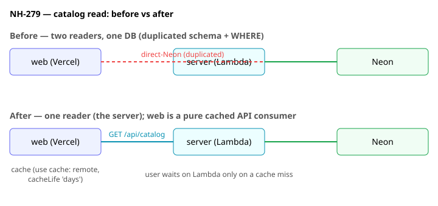

# ADR: Catalog read via the server API (service boundary) — NH-279

**Date:** 2026-07-14 · **Status:** Accepted · **Supersedes:** the direct-Neon catalog-read path of the [2026-07-08 hybrid-BFF ADR](2026-07-08-fe-nextjs-vercel-aws-bff-adr.md) (that ADR otherwise stands).

## Context

PR #140 had `web/` read Neon directly, per the 2026-07-08 BFF ADR. Review found it re-implemented the
server's catalog read almost verbatim: `web/app/lib/catalog-schema.ts` duplicated the server's Drizzle
`playable` table, and `web/app/catalog/page.tsx` duplicated the ARCH-AUTHZ-1 visibility `WHERE`
(`status='published' AND listable=true AND origin='curated' AND kind IN (...)`), the `.limit(50)`, the
kind-guard, and `toDifficulty`. The visibility `WHERE` had already diverged once (web was missing
`origin = 'curated'`), and the surface grows with every filter/sort.

The obvious fix — extract the schema/policy into `@notation-hero/shared` and import from both runtimes —
does not work. `shared` is ESM (`type: module`); the NestJS server is CJS + `nodenext`. TypeScript
resolves `drizzle-orm`'s types in import-mode for one and require-mode for the other and treats them as
two incompatible `PgColumn`/`SQL` types (the "separate declarations of private property
`shouldInlineParams`" error), so a shared `playable` table cannot be used with the server's
`eq`/`and`/`inArray`. Both `pnpm typecheck` and `nest build` failed; the server is the hard wall.
Making it work would need a dual-built (CJS+ESM) data-access package — a build toolchain + build-order
dependency, against the repo's plain-pnpm ethos.

## Decision

Web stops reading Neon and instead fetches the server's existing `GET /api/catalog` **server-side**,
caching the response. `shared/` holds only a **pure TypeScript response contract**
(`CatalogItem`/`CatalogResponse` — no drizzle, no runtime), imported by the server (to type its
response) and web (to type the fetch). The server keeps the schema, visibility `WHERE`, `toDifficulty`,
kind-guard, and the Neon client in its `adapters/`/`modules/`.

**Supersede-scope:** this replaces the direct-Neon read path **for the catalog and any
Drizzle-schema-dependent read**. It is not a blanket prohibition — a future read that does not share a
Drizzle schema across the CJS/ESM boundary may still use direct Neon access per the 2026-07-08 ADR.

## Consequences

**Positive:** removes the duplication and the ESM/CJS hazard in one move (the fix is deletion); web sheds
`drizzle-orm` + `@neondatabase/serverless`; `shared/` carries only its chartered pure contract; the
service boundary matches database-per-service. The duplication was a symptom of the shared-DB coupling —
this removes the coupling.

**Negative (accepted):** it amends the ratified 2026-07-08 ADR, and re-adds a Lambda hop on cache-miss
reads. The latency is bounded and cacheable-away — a user waits on the Lambda only on a cold blocking
miss (first load / >1 week idle) or the first visit right after an admin purge; steady-state hits and the
background stale-while-revalidate refresh never make a user wait. Cold-start latency is not yet measured
(follow-up).

## Alternatives rejected

- **Built shared `db` package (dual CJS+ESM).** Keeps direct-Neon reads but entrenches the shared DB and
  pays a build-tool + build-order tax. Manages the coupling instead of removing it.
- **Share pure-only** (`toDifficulty` + kind allow-list + guard). Zero hazard, but the schema — the
  biggest duplication — stays duplicated.
- **Accept the duplication** (status quo). The `WHERE` already diverged once and the surface grows with
  every filter; deferring to oRPC (NH-123) compounds the drift risk.
- **Server ESM migration.** Rejected in `ARCH-FMT-1` — NestJS decorator metadata / `reflect-metadata` /
  `@codegenie/serverless-express` are CJS-rooted; ESM output adds interop friction for zero gain.

## Enforcement

Prose-grade, with machine-visible signals: web's `package.json`/`pnpm-lock.yaml` no longer list
`drizzle-orm` or `@neondatabase/serverless` (a regression re-adds them, visible in review); the
dependency-cruiser hexagon fence keeps the schema/policy in the server's `adapters/`/`modules/`.

## Follow-ups

- Secured `revalidateTag('catalog')` route + admin publish/refresh button (ships with admin/CMS work).
- Runtime response validation (Zod in `shared/`) — recommended fast-follow; relocates, doesn't remove, the drift risk of the current type cast.
- Cold-start latency benchmark for the catalog endpoint.
- Server-side filtering/search/pagination (NH-123) — the API grows query params and caching shifts to per-key; Path 2 is the right base (query logic lives once in the server).
