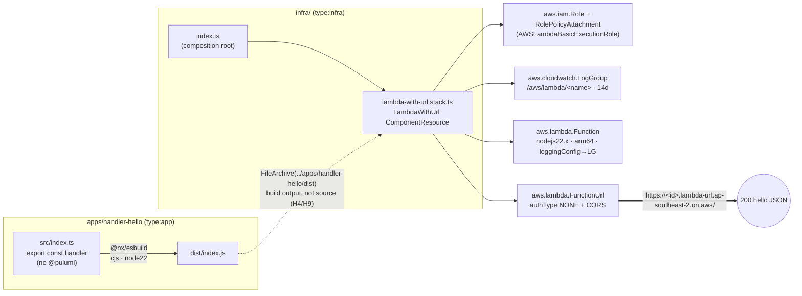

# feat: NH-150 — first `pulumi up` (hello-world Lambda Function URL + CloudWatch)

## Summary

Stand up the repo's first deployable AWS infrastructure: a hello-world Lambda behind a public **Function URL**, logging to a managed **CloudWatch LogGroup**, deployed to `ap-southeast-2` with state on **Pulumi Cloud** (free tier). Built the full-hexagonal way — a runtime handler in `apps/`, the Pulumi `LambdaWithUrl` ComponentResource + composition in `infra/`, wired to the handler's **build output** (never its source). This ships the **Pulumi program** as a reviewable PR; the actual `pulumi up` (real AWS resources + a public endpoint) is a gated, human-approved final step.

This is **NH-150** (Track-2 / NH-119) — the AWS proof-of-life for Alpha and the unblocker for NH-151 (OIDC) → NH-146/114 (deploy).

## Problem Frame

The workspace is greenfield below the layer dirs: `core/ adapters/ apps/` are empty `.gitkeep`; `infra/` is a stub (placeholder `echo` scripts, `type:infra` tag). No `@pulumi/*` deps exist. AWS creds are live and verified (IAM user `notation-hero-pulumi-local`, account `<redacted>`, region `ap-southeast-2`; NH-149 Done). Pulumi CLI v3.243 is logged into Pulumi Cloud as `leocaseiro`. So everything the deploy needs exists **except the code**.

---

## Requirements

### Deliverable

- R1. `pulumi up` provisions a Node Lambda + a public Function URL in `ap-southeast-2`; an HTTP GET to the URL returns a `200` JSON hello payload.
- R2. The Lambda logs to an **explicit** `aws.cloudwatch.LogGroup` (`/aws/lambda/<fn-name>`) with **finite** retention (14 days) — never the auto-created never-expire group.
- R3. State lives on Pulumi Cloud (free tier); the deploy costs **$0** (always-free Lambda + Function URL + CloudWatch at hello-world scale).

### Architecture (hexagonal; honors locked H1–H4)

- R4. The runtime handler lives in `apps/handler-hello` (`type:app`) and imports **no** `@pulumi/*` (depcruise H8).
- R5. The `LambdaWithUrl` Pulumi ComponentResource + the stack composition live in `infra/` (`type:infra`, imports `@pulumi/*` — H3). See KTD1.
- R6. `infra/` references the handler's **build output** via `pulumi.asset.FileArchive("../apps/handler-hello/dist")` and an Nx build dependency — never an import of handler source (H4, H9, no-apps-to-infra).

### Green-CI parity

- R7. New code passes the **live** gates: depcruise (H8/H9/H10/H11, no-circular, no-orphans), `tooling/check-layout.sh` (kebab + approved role suffix, co-located tests, no `__tests__/`), syncpack, knip, commitlint, semgrep, gitleaks, osv-scanner.
- R8. `.pulumi/` plus Pulumi state/secret artifacts are git-ignored **and** nx-ignored (decision M8); `Pulumi.yaml` + `Pulumi.<stack>.yaml` are committed.

---

## Key Technical Decisions

- **KTD1 — The Pulumi component lives in `infra/`, not `adapters/aws`.** The ticket text ("`@notation-hero/adapters-aws` `LambdaWithUrl`") comes from the **stale** `docs/cicd-pipeline.md`, written before the 2026-06-12 ADR locked H8–H11. The **live** `depcruise` rule `no-infra-to-app-or-domain-source` (H9) makes `infra/ → adapters/ source` an error, H3 places IaC in `infra/`, and `check-layout.sh` has **no `.component` suffix** (`.stack` is approved, `.adapter` is semantically wrong for IaC). So the component is `infra/lambda-with-url.stack.ts`. This also avoids inventing `adapters/aws` before its real runtime feature (the Neon repository) lands — consistent with the no-invented-features convention. Reusable cross-stack extraction (a shared `infra` lib) is a later move if a second stack ever needs it.
- **KTD2 — Runtime `nodejs22.x`; esbuild `target: node22`.** AWS Lambda's newest Node runtime is `nodejs22.x` (Node 24 is not a Lambda runtime / carries caveats). `.nvmrc=24` governs the **build host** only. This is the M5/L12-pin "Lambda-runtime match" axis.
- **KTD3 — esbuild `format: cjs`, not esm.** `@nx/esbuild:esbuild` defaults to `["esm"]`; Lambda's robust default is **cjs** (`export const handler` → `exports.handler`, resolved by the `index.handler` string). Avoids ESM-on-Lambda footguns (`.mjs`/`type:module`, `__dirname`).
- **KTD4 — Explicit LogGroup, created before the Function, wired via `loggingConfig.logGroup`.** Prevents Lambda lazily auto-creating an unmanaged `/aws/lambda/<name>` group with infinite retention. Requires **pinning the Function `name`** so the group name is deterministic. `loggingConfig.logGroup` (not bare `dependsOn`) is what actually redirects logging; `dependsOn` is belt-and-suspenders.
- **KTD5 — Function URL `authorizationType: "NONE"` (public) [auto-decided, C2].** Needed to `curl` without SigV4. No `aws.lambda.Permission` resource required — AWS auto-attaches the public-access policy. Throwaway hello-world (no data, no secrets); teardown after demo.
- **KTD6 — Packaging via `FileArchive(dist)`.** esbuild bundles `apps/handler-hello/src/index.ts` → `apps/handler-hello/dist/index.js` (self-contained, no SDK import for hello-world); infra packages the **directory** with `pulumi.asset.FileArchive`; handler string is `index.handler`.
- **KTD7 — Pulumi run targets are local-only.** `pulumi preview/up/destroy` run via `nx:run-commands` and need AWS creds + the Pulumi token; CI has neither. CI gates the new projects with `typecheck` + `test` + `build` + depcruise/check-layout only — never `pulumi up`.
- **KTD8 — arm64 (Graviton).** Cheaper per-ms, good cold starts; the pure-JS bundle is arch-neutral.

## Assumptions (pipeline auto-decisions — interrupt to change)

- C1 → **Minimal** component surface: role + basic-exec attachment + LogGroup + Function + Function URL, exposing the URL output. No memory/env/layers/VPC knobs yet.
- C2 → Function URL **`NONE`** (see KTD5).
- Stack name **`dev`**; region **`ap-southeast-2`**; retention **14 days**; architecture **arm64**.
- Component pinned versions (per research, latest): `@pulumi/pulumi ^3.246`, `@pulumi/aws ^7.32`, `esbuild ^0.28`, `@nx/esbuild` matching the repo's Nx, `aws-lambda` types (devDep).

---

## High-Level Technical Design



Dependency direction stays legal: `apps` imports nothing in-repo and no `@pulumi`; `infra` imports `@pulumi` + its own `.stack` file (intra-layer, allowed) and references the app via **build output**, never source.

## Output Structure

```text
apps/handler-hello/
  src/index.ts                 # the Lambda handler (exports `handler`); esbuild entry
  src/index.test.ts            # co-located unit test
  project.json                 # @nx/esbuild:esbuild build target (cjs, node22)
  package.json                 # name @notation-hero/handler-hello; aws-lambda (dev)
  tsconfig*.json
infra/
  index.ts                     # composition root (instantiates LambdaWithUrl)
  lambda-with-url.stack.ts     # the ComponentResource
  lambda-with-url.stack.test.ts# co-located unit test (pulumi mocks)
  Pulumi.yaml                  # project: runtime nodejs, main index.ts
  Pulumi.dev.yaml              # stack config: aws:region ap-southeast-2
  package.json                 # @pulumi/pulumi, @pulumi/aws (real scripts replace echo stubs)
  project.json                 # build/typecheck/test + pulumi preview/up/destroy targets
  tsconfig*.json
.gitignore / .nxignore         # + .pulumi/, Pulumi stack state/secrets (M8)
pnpm-workspace.yaml            # catalog entries for the new deps
.dependency-cruiser.cjs        # + no-orphans entry-point exemptions for the 2 composition roots
```

---

## Implementation Units

### U1. Workspace dependencies + ignore hygiene

**Goal:** Land the Pulumi/AWS toolchain versions and the M8 ignore rules so later units typecheck and don't leak state into git/Nx.
**Requirements:** R8. **Dependencies:** none.
**Files:** `pnpm-workspace.yaml` (catalog: `@pulumi/pulumi`, `@pulumi/aws`, `esbuild`, `aws-lambda`, `@nx/esbuild`), `.gitignore`, `.nxignore`.
**Approach:** Add catalog version pins only (no package.json refs yet — those land with their consumers in U2/U3, keeping syncpack/knip honest). Ignore `**/.pulumi/`, `**/Pulumi.*.bak`, and any local state; keep `Pulumi.yaml`/`Pulumi.<stack>.yaml` tracked. Verify `@nx/esbuild` version matches the installed Nx.
**Test scenarios:** Test expectation: none — config/ignore only.
**Verification:** `pnpm install` resolves; `git status` shows no `.pulumi/` noise after a later `pulumi` invocation.

### U2. `apps/handler-hello` runtime handler + esbuild build

**Goal:** A `type:app` Lambda handler that returns a hello JSON, bundled cjs/node22 to `dist/`.
**Requirements:** R1, R4, R7. **Dependencies:** U1.
**Files:** `apps/handler-hello/src/index.ts`, `apps/handler-hello/src/index.test.ts`, `apps/handler-hello/project.json`, `apps/handler-hello/package.json`, `apps/handler-hello/tsconfig*.json`.
**Approach:** `export const handler = async (): Promise<...> => ({ statusCode: 200, headers: { "content-type": "application/json" }, body: JSON.stringify({ message: "hello from notation-hero" }) })`. Types from `aws-lambda` (devDep, stripped at build — never a runtime `@pulumi` path). `@nx/esbuild:esbuild` target with `platform:node`, `format:["cjs"]`, `bundle:true`, `esbuildOptions:{ target:"node22", sourcemap:true }`, `outputs:["{projectRoot}/dist"]`. Confirm the emitted file is `dist/index.js` so the Lambda handler string is `index.handler`.
**Patterns to follow:** existing `project.json`/`package.json` shape in `infra/`; the `type:app` tag.
**Test scenarios:**

- Happy path — `handler()` resolves to `statusCode === 200`.
- Body shape — parsed `body` has `message` containing "hello"; `content-type` is `application/json`.
- Covers R1 (the response contract the deployed URL must return).
  **Verification:** `nx build handler-hello` emits `dist/index.js`; `nx test handler-hello` green; depcruise shows no `apps → @pulumi`; check-layout passes.

### U3. `infra/` Pulumi program — `LambdaWithUrl` component + composition

**Goal:** The `LambdaWithUrl` ComponentResource and the stack that composes it against the handler's build output.
**Requirements:** R1, R2, R5, R6, R7. **Dependencies:** U1, U2.
**Files:** `infra/lambda-with-url.stack.ts`, `infra/lambda-with-url.stack.test.ts`, `infra/index.ts`, `infra/Pulumi.yaml`, `infra/Pulumi.dev.yaml`, `infra/project.json` (replace echo stubs), `infra/package.json` (real scripts + `@pulumi/*` deps), `infra/tsconfig*.json`.
**Approach:** Component (`extends pulumi.ComponentResource`, token `"nh:aws:LambdaWithUrl"`): IAM Role (lambda assume-role) → `RolePolicyAttachment` to `aws.iam.ManagedPolicy.AWSLambdaBasicExecutionRole` → `LogGroup` (`name: /aws/lambda/<functionName>`, `retentionInDays: 14`) → `Function` (`name` pinned, `runtime: "nodejs22.x"`, `architectures:["arm64"]`, `code`, `handler:"index.handler"`, `loggingConfig:{ logFormat:"JSON", logGroup }`) → `FunctionUrl` (`authorizationType:"NONE"`, basic CORS). Expose `url`; `registerOutputs`. `index.ts` instantiates it with `code: new pulumi.asset.FileArchive("../apps/handler-hello/dist")` and `export const url`. `Pulumi.yaml`: `runtime: nodejs`, `main: index.ts`. `Pulumi.dev.yaml`: `aws:region: ap-southeast-2`. `project.json`: `build`/`typecheck`/`test` (tsc + vitest) plus `preview`/`up`/`destroy` via `nx:run-commands` with `dependsOn:["handler-hello:build"]` and `implicitDependencies:["handler-hello"]`.
**Approach (boundary, load-bearing):** Add `infra/index.ts` (and, only if untested, the handler entry) to the `no-orphans` `pathNot` exemptions in `.dependency-cruiser.cjs` — the config comment explicitly sanctions "add entry-point exemptions when app/infra composition roots arrive." Keep that edit minimal and explained (it's a CODEOWNERS-protected enforcement file).
**Patterns to follow:** the research synthesis component sketch; Pulumi's official "Build a Component" guide; `pulumi/examples` nx-monorepo `nx.json`.
**Test scenarios (pulumi mocks via `pulumi.runtime.setMocks`):**

- Creates a `Function` with `runtime === "nodejs22.x"` and `architectures` containing `arm64`.
- Creates a `LogGroup` whose `name` is `/aws/lambda/<functionName>` with `retentionInDays === 14`. Covers R2.
- Creates a `FunctionUrl` with `authorizationType === "NONE"`. Covers R1/C2.
- Exposes a non-empty `url` output.
  **Verification:** `nx typecheck infra` + `nx test infra` green; `nx build infra` (tsc) green; `pnpm depcheck` green (infra imports `@pulumi` + own source only — no `apps/core/adapters` source); check-layout passes (`.stack` suffix, co-located test).

### U4. Green-CI parity pass

**Goal:** The whole workspace is green under every live gate before the PR.
**Requirements:** R7, R8. **Dependencies:** U2, U3.
**Files:** as needed — `knip.json`/`.syncpackrc.json` only if the new deps surface a false positive; `nx.json` `targetDefaults` if build-ordering/outputs need declaring.
**Approach:** Run the actual CI command set locally (`pnpm depcheck`, `pnpm check:layout`, `pnpm knip`, `pnpm syncpack`/lint, `nx run-many typecheck/test/build`, `pnpm check:coverage-ignore`). Resolve real failures (e.g. knip flagging `@pulumi/aws` if it can't trace the program → add a scoped `ignoreDependencies` entry with a comment, not a blanket disable). Confirm depcruise no-orphans passes with the new entry-point exemptions.
**Test scenarios:** Test expectation: none — verification unit (exercises existing test suites, adds none).
**Verification:** every gate green locally; no `eslint-disable`/ignore added without a reason (no-escape-hatches).

### U5. Deploy & verify — LOCAL, human-gated

**Goal:** Prove R1–R3 against real AWS. **Not run by the pipeline** — requires explicit user approval (real resources + a public endpoint).
**Requirements:** R1, R2, R3. **Dependencies:** U4 + merged/approved PR.
**Files:** none (operational); capture results in the NH-150 ticket.
**Approach:** `nx build handler-hello` → `pulumi -C infra stack init dev` (first time) → `pulumi -C infra up` → `curl` the `url` output (expect `200` hello JSON) → confirm an invocation log line in the `/aws/lambda/<name>` CloudWatch group → optionally `pulumi destroy` after the demo. Confirm the zero-spend budget alert stayed quiet.
**Test scenarios:** Manual acceptance: URL returns 200 hello JSON; CloudWatch shows the invocation; AWS bill stays $0.
**Verification:** screenshots/output pasted into NH-150; transition NH-150 → Done.

---

## Risks & Dependencies

- **depcruise `infra → component` resolution (highest risk).** KTD1 keeps the component _inside_ `infra/`, so the import is intra-layer (`infra → infra`) — no H9 exposure. If a future change moves it to `adapters/`, H9 will fire on the symlink-resolved real path; don't. Verify with `pnpm depcheck` in U3.
- **no-orphans on composition roots.** `infra/index.ts` is nothing's dependency → an orphan unless exempted. The `.dependency-cruiser.cjs` edit (U3) is required and sanctioned by the config's own comment; surface it explicitly in the PR.
- **`@nx/esbuild` esm default (KTD3).** Forgetting the `cjs` override yields an ESM bundle that mis-loads on Lambda. Pinned in U2.
- **LogGroup auto-create (KTD4).** Only the explicit group + `loggingConfig.logGroup` + pinned name prevents the unmanaged never-expire group.
- **Pulumi targets in CI.** `pulumi up/preview` need creds/token CI lacks — they must stay out of the CI target set (KTD7).
- **Function URL data egress** is free to ~100 GB/mo direct-to-internet; trivially within the zero-spend budget at hello-world scale.

## Alternatives Considered

- **Component in `adapters/aws` (the ticket's literal text).** Rejected per KTD1: `infra → adapters` source is a live depcruise error, IaC belongs in `infra/` (H3), no `.component` suffix exists, and it would invent `adapters/aws` before its real runtime feature. A built-package import _might_ dodge H9, but it adds `build:dts` + package-exports complexity for no benefit at this scale.
- **Single inline-code Lambda in `infra/` (no separate handler app).** Rejected: violates H1/H2 (handler must live in `apps/`, not `infra/`) and forfeits the build-output wiring that is the whole portfolio point of D1=A.

## Open Questions

- **Deploy gate (U5).** The actual `pulumi up` is held for explicit user approval — real AWS resources and a publicly reachable endpoint. Everything up to and including the PR is autonomous.

## Sources / Research

- [aws.lambda.FunctionUrl](https://www.pulumi.com/registry/packages/aws/api-docs/lambda/functionurl/) · [aws.lambda.Function](https://www.pulumi.com/registry/packages/aws/api-docs/lambda/function/) · [aws.cloudwatch.LogGroup](https://www.pulumi.com/registry/packages/aws/api-docs/cloudwatch/loggroup/)
- [Build a Component — Pulumi](https://www.pulumi.com/docs/iac/guides/building-extending/components/build-a-component/) · [Using Pulumi inside Nx monorepos](https://www.pulumi.com/blog/nx-monorepo/) · [pulumi/examples nx-monorepo](https://github.com/pulumi/examples/blob/master/nx-monorepo/nx.json)
- [LogGroup not deleted after loggingConfig change (pulumi #18223)](https://github.com/pulumi/pulumi/issues/18223) · [Node.js 24 runtime caveats — AWS](https://aws.amazon.com/blogs/compute/node-js-24-runtime-now-available-in-aws-lambda/) · [esbuild cjs/esm mixing](https://dev.to/marcogrcr/nodejs-and-esbuild-beware-of-mixing-cjs-and-esm-493n)
- Repo: `docs/decisions/decision-registry.md` (H1–H11, M5/M8, NAME-suffix), `.dependency-cruiser.cjs`, `tooling/check-layout.sh`, `docs/cicd-pipeline.md` (origin; partially stale).
