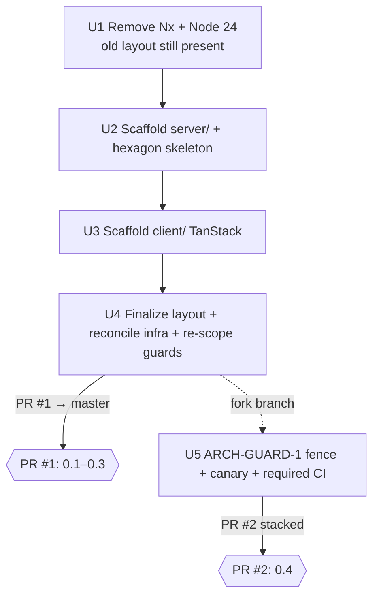

# feat: ADR §1 Foundation Phase 0 — drop Nx → pnpm workspaces + scaffold `server/` & `client/`

## Summary

Execute **Phase 0** of the approved architecture ADR (`docs/decisions/2026-06-17-architecture-decisions.md`): remove Nx in favour of plain pnpm workspaces, move the repo to the `client/ server/ shared/ infra/` layout, scaffold a blank NestJS 11 backend into `server/` and a blank Vite + TanStack Router + Query SPA into `client/`, and bump Node 22 → 24. The full hexagon dependency fence (ARCH-GUARD-1) lands as a **second, stacked PR** to keep review surfaces small.

Delivered as **two PRs**:
- **PR #1** — units U1–U4 (0.1 Nx removal + green-CI config surgery, 0.2 Nest scaffold, 0.3 TanStack scaffold). Branch `worktree-nh-foundation-phase0` off `origin/master`.
- **PR #2** — unit U5 (0.4 ARCH-GUARD-1: dependency-cruiser folder-fence + core-purity allow-rule + canary as a required CI check). Forked/stacked on PR #1's branch.

Every implementation unit is an atomic, green, cherry-pickable commit. Scaffolds use the **official generators** (`nest new`, `@tanstack/cli create`); everything else is config surgery on existing files or the custom hexagon skeleton (no generator produces those).

---

## Problem Frame

A week of setup friction came from wiring **Nx** into pnpm + the generators, and the audit found Nx earns nothing today: every target is `nx:run-script` wrapping pnpm scripts, `nx affected` does no real filtering in CI, and the only live hexagon guard (dependency-cruiser) is Nx-independent. The ADR decided to remove Nx now — while `core/` and `adapters/` are still empty `.gitkeep` and almost no application code has shipped — because changing the foundation is cheapest before features depend on it (ADR §0, ARCH-MONO-1).

This plan turns six §1 decisions plus the Phase-0 Node bump into concrete, sequenced edits. It is **not** the deployable AWS slice (ADR Phase 1) and **not** the backend build/Lambda topology, client libraries, auth, or security work (ADR §2–§5) — those are explicitly out of scope here.

The current repo (`origin/master`) is the **old Nx layout**: top-level `apps/ core/ adapters/ infra/`, with `apps/handler-hello/` (the NH-150 hello-world Lambda placeholder) and a real `infra/` Pulumi stack; `core/` and `adapters/` are empty. Node is pinned `>=22.18` in `package.json` (`.nvmrc` is already `24`).

---

## Requirements (traceability to the ADR)

| ID | ADR decision | What Phase 0 must do |
|---|---|---|
| R1 | **ARCH-MONO-1** | Remove all Nx artifacts; root scripts become `pnpm -r` / `pnpm --filter`. Regenerate a clean root `package.json`. |
| R2 | **ARCH-PM-1** | Keep pnpm (no bun). No-op beyond confirming `packageManager`/lockfile stay. |
| R3 | **ARCH-LAYOUT-1** | Repo layout becomes `client/ server/ shared/ infra/`; retire `apps/ core/ adapters/`. |
| R4 | **ARCH-HEX-1** | `server/src/` carries the hexagon folder skeleton: `core/ adapters/ modules/ entry/`. |
| R5 | **ARCH-NAME-1** | Relax `tooling/check-layout.sh` to NestJS-native filenames; keep kebab-case + co-located tests. |
| R6 | **ARCH-GUARD-1** (PR #2) | dependency-cruiser rewritten folder-level under `server/src/`, with a fail-closed core-purity allow-rule and a canary wired as a **required** CI check. |
| R7 | **ARCH-FMT-1 (Node pin only)** | Bump Node 22 → 24 in the four pins the ADR names; `.nvmrc` already 24. |
| R8 | Delivery constraint (user) | Two PRs (U1–U4, then U5); commit every green step; track on Jira **NH-195** under epic **NH-176**. |

Out of scope, deferred to later phases/specs: the deployable AWS slice (Phase 1), SWC/esbuild bundling topology and Lambda entry wiring beyond the folder skeleton (ARCH-BUILD-1/LAMBDA-1/FMT-1 bundler work), the oRPC contract, Drizzle, Dexie, auth, CSP, and any real domain code.

---

## Key Technical Decisions

### KTD1 — Regenerate the root `package.json`, don't surgically un-pick Nx
Per ADR ("regenerate a clean root `package.json` rather than surgically un-picking it"). Drop devDeps `@nx/eslint`, `@nx/eslint-plugin`, `@nx/js`, `nx`. Rewrite the per-target scripts `lint/typecheck/test/build` from `nx run-many --target=X` → **`pnpm -r --if-present run X`** (one target per script — this singular form is correct; multi-token `pnpm -r lint typecheck` is **not**, see KTD12). **`depcheck` stays a direct `depcruise <dirs> --config …` invocation** — it is a single root cruise, *not* a per-package target, so it must never become a `pnpm -r` form (that would find zero `depcheck` scripts and pass vacuously, silently disabling the only live hexagon guard). Its **dir args change by commit**: `core adapters apps infra` in U1 (all still exist → green), `server shared infra` in U4. Also bump `engines.node` `>=22.18` → `>=24` and `@types/node` `^22.10.0` → `^24` (see KTD12).

### KTD2 — `pnpm-workspace.yaml` packages → `client server shared infra`; clean `allowBuilds`
Packages globs become the four folders (changed in U4; `server`/`client` added incrementally in U2/U3). `allowBuilds`: **drop `nx`**; keep `@swc/core` (Nest SWC), `lefthook`, `esbuild`, `protobufjs` (Pulumi gRPC), `unrs-resolver: false`; **add `lightningcss`** (TanStack/Vite native dep — verify present via `pnpm why lightningcss` before adding). Keep the `overrides` block (form-data, tmp CVE pins).

### KTD3 — Generator commands (source-verified, run non-interactively) + Nest-native SWC config
- **Nest:** `nest new server -s -g -p pnpm` via `@nestjs/cli@11.0.23` (scaffolds NestJS 11). `-s` skip nested install, `-g` skip nested `git init`, `-p pnpm`. Emits `server/{src/{app.module.ts,app.controller.ts,app.service.ts,app.controller.spec.ts,main.ts},test/,package.json,tsconfig*.json,nest-cli.json,eslint.config.mjs,.prettierrc}`.
- **TanStack:** `npx @tanstack/cli@latest create client --router-only --target-dir ./client --add-ons tanstack-query -p pnpm --no-install --no-git` via `@tanstack/cli@0.69.3` (canonical; `create-tsrouter-app` is a soft-deprecated alias). Scaffolds Vite 8 / React 19.2 / Router 1.170 / Query 5.101; **TanStack Query is wired by the `--add-ons` generator, not hand-coded**; SPA (no SSR/Start).
- **SWC config — use the Nest-native builder, not a hand-rolled `.swcrc`:** set `nest-cli.json` `"compilerOptions": { "builder": "swc" }`. The Nest SWC builder supplies the decorator defaults itself (`module.type=commonjs`, `jsc.target=es2021`, `legacyDecorator`+`decoratorMetadata`+`keepClassNames`) and deep-merges any `.swcrc` on top — so no standalone `.swcrc` is authored in Phase 0. A hand-written `.swcrc` only becomes necessary when bundling per-entry with esbuild *outside* `nest build` — that is ADR §2 (deferred), not Phase 0.
- **Generator coverage:** these two CLIs scaffold everything that *can* be generated (both apps + the Query add-on + each app's eslint/tsconfig/test configs). Future Nest features use `nest g module|controller|…` (the reason ARCH-NAME-1 keeps NestJS-native filenames). `shared/`'s `package.json` is seeded with `pnpm init`.

### KTD4 — ARCH-HEX-1 reshape (skeleton only; no fence yet)
After `nest new`, create `server/src/{core,adapters,modules,entry}/` and move the scaffold's `app.*` into `modules/` and `main.ts` into `entry/`, leaving `core/` + `adapters/` as `.gitkeep` placeholders. Update imports + `nest-cli.json` `sourceRoot`/`entryFile` so `nest build`/`start` still resolve. The hexagon *direction* is not enforced until PR #2 (ARCH-GUARD-1). **The Nest entry file `server/src/entry/main.ts` is a composition-root entry point** — it must be exempted from the `no-orphans` depcruise rule in U4 (see KTD9).

### KTD5 — `check-layout.sh`: re-scope to `server/src`, relax suffix vocabulary
The role-suffix taxonomy applies to the **backend hexagon only** — re-scope the Rule-2 path match from `core/|adapters/|apps/|infra/` to `server/src/`. `client/` (React conventions) and `infra/` (Pulumi `.stack.ts`, already covered) are not subject to the suffix vocabulary. Extend `approved_suffix` with `module|guard|pipe|interceptor|filter|middleware|strategy|resolver|schema|policy` (ADR ARCH-NAME-1 — note **`policy`** is currently missing and is required by ARCH-AUTHZ-1/OWN-1 later). Exempt `main.{ts,tsx}` (Nest entry) alongside the existing `index.*` exemption. **This relax lands in U2** (so the server scaffold passes on its own commit); U4 only verifies it — there is no conditional re-application.

### KTD6 — Minimal guard surgery in PR #1; full fence in PR #2
PR #1 keeps CI green without building a new architectural fence:
- **ESLint** (`.eslintrc.cjs`): remove the `@nx` plugin and the entire `@nx/enforce-module-boundaries` override block (the plugin is uninstalled with Nx). Re-point `boundaries/elements` + the `core/**` `no-restricted-imports` override + `boundaries/dependencies` from `core|adapters|apps` to the new layout (`server/src/*` element folders). *(Note: the per-package `lint` scripts are currently `echo` placeholders and `.eslintrc.cjs` is wired to no live lint lane — these edits are correctness/documentation until the flat-config lane lands, NH-42. They still must be consistent.)*
- **dependency-cruiser** (`.dependency-cruiser.cjs`): in PR #1, keep the cruise running by (a) keeping `depcheck` a direct `depcruise <dirs>` call with dir args matching what exists at each commit (KTD1), and (b) in U4, updating the `no-orphans` `pathNot` exemptions for the new composition-root/stub entries (KTD9) before re-pointing the dirs to `server shared infra`. The full folder-level rule rewrite + core-purity allow-rule + canary is **U5 / PR #2** (ARCH-GUARD-1).

### KTD7 — Node 22 → 24 (the four pins)
`.nvmrc` is already 24. Bump: (1) root `package.json` `engines.node` `>=22.18` → `>=24`; (2) `infra/lambda-with-url.stack.ts` runtime default `"nodejs22.x"` → `"nodejs24.x"`; (3) `infra/lambda-with-url.stack.test.ts:62` assertion `"nodejs22.x"` → `"nodejs24.x"`; (4) the new `server/` esbuild/SWC target `node24` (no `apps/handler-hello` `--target=node22` survives — see KTD8). Update the `.npmrc` comment that references `nx test infra`. `.github/actions/setup-js` reads Node from `.nvmrc` — no change needed there.

### KTD8 — Reconcile `apps/handler-hello` + `infra/`
`apps/handler-hello` is the pre-Nx placeholder Lambda, superseded by `server/`; `apps/` is retired by ARCH-LAYOUT-1. Delete `apps/`. Keep the reusable `infra/lambda-with-url.stack.ts` component + its mock-based test (update the runtime assertion per KTD7). Repoint `infra/index.ts` `FileArchive("../apps/handler-hello/dist")` to a placeholder inline `StringAsset` hello handler so the Pulumi program is self-contained (the real `server/` → Lambda wiring is **Phase 1**, not now). Update `infra/package.json` `pulumi:preview`/`pulumi:up` to drop the `nx build @notation-hero/handler-hello &&` prefix. CI never runs Pulumi, so build/typecheck/test stay green regardless.

### KTD9 — CI `changes` paths-filter, `nx-set-shas`, and the `no-orphans` exemptions
`.github/workflows/ci.yml`: remove both `nrwl/nx-set-shas@v4` steps (in `quality` and `build`). Rewrite the `code` and `apps` path filters: `core/** adapters/** apps/**` → `client/** server/** shared/**`; **drop `nx.json`**. Without this the jobs would silently skip on changes to the new dirs → false green (the file's own comment warns of exactly this).

**`no-orphans` exemptions (load-bearing — prevents a red PR #1):** the live `no-orphans` rule in `.dependency-cruiser.cjs` is `severity: "error"` and its `pathNot` allowlist currently exempts only `^infra/index\.ts$` and `^apps/handler-hello/src/index\.ts$`. After the migration, the Nest composition root `server/src/entry/main.ts` (imported by nothing — it *is* the entry) and the `shared/index.ts` stub (no consumer yet) would be flagged as orphans → non-zero exit → red `depcheck`. In U4, **add `^server/src/entry/main\.ts$` and `^shared/index\.ts$` to `pathNot`, and remove the stale `^apps/handler-hello/src/index\.ts$` entry** (that file is deleted).

### KTD10 — `tsconfig.base.json` path aliases
Retire the stale `@core/* @adapters/* @apps/*` aliases (those dirs are removed). `server/` and `client/` get their own tsconfigs from the generators; add a `@shared/*` → `shared/*` alias only if/when needed. The root `tsconfig.json` (solution config, `files: []`, used by depcruise for resolution) stays.

### KTD11 — Two-PR stacked delivery
PR #1 = U1–U4 (base `master`). PR #2 = U5, on a branch **forked from PR #1's branch** so its diff is only the ARCH-GUARD-1 fence; retarget PR #2 to `master` after PR #1 merges. *(Open question OQ1 confirms the exact base.)*

### KTD12 — Keep `syncpack` green across the scaffold version drift
The CI `quality` job runs `pnpm run syncpack` (`syncpack lint`), and `.syncpackrc.json` has empty version groups → syncpack fails on *any* cross-package version disagreement. The Nest and TanStack generators pin their own `typescript`, `@types/node`, `eslint`, `@typescript-eslint/*` versions that will differ from the root pins and each other — compounded by the Node 24 bump (root `@types/node ^22` vs a scaffold's `@types/node 24`). Reconcile in the same units that introduce the drift: run `pnpm exec syncpack fix-mismatches` (or hand-align to root pins) immediately after each scaffold (U2, U3), and bump root `@types/node` → `^24` in U1. Verify `pnpm run syncpack` green per unit.

**`pnpm -r` multi-token syntax (correctness rule, applies everywhere):** `pnpm -r run X Y` runs only script `X` with `Y` as a positional arg — it does **not** run `Y`. So never write `pnpm -r lint typecheck`. Use the root scripts (`pnpm run lint && pnpm run typecheck && pnpm run test && pnpm run build`) — each is the individually-correct `pnpm -r --if-present run <target>` — and chain them with `&&` in lefthook hooks and verification steps.

---

## High-Level Technical Design

### Layout transition

```
BEFORE (Nx)                          AFTER (pnpm workspaces)
notation-hero/                       notation-hero/
├─ apps/handler-hello/   (Lambda)    ├─ client/    React SPA (Vite + TanStack)
├─ core/        (.gitkeep)           ├─ server/    NestJS 11 app
├─ adapters/    (.gitkeep)           │  └─ src/{core,adapters,modules,entry}/
├─ infra/       (Pulumi)             ├─ shared/    placeholder (oRPC contract later)
├─ nx.json, .nxignore                ├─ infra/     Pulumi (kept; handler ref repointed)
└─ project.json ×2                   └─ pnpm-workspace.yaml: client/server/shared/infra
```

### Commit / PR sequence (each commit green)



---

## Output Structure (end state after PR #1)

```
notation-hero/
├─ client/                  # @notation-hero/client — Vite + TanStack Router + Query SPA
│  ├─ src/{main.tsx,router.tsx,routes/,integrations/tanstack-query/,routeTree.gen.ts}
│  ├─ index.html, vite.config.ts, tsconfig.json, package.json, eslint.config.mjs
├─ server/                  # @notation-hero/server — NestJS 11
│  ├─ src/
│  │  ├─ core/.gitkeep      # framework-free domain (skeleton)
│  │  ├─ adapters/.gitkeep  # I/O (skeleton)
│  │  ├─ modules/           # app.module.ts, app.controller.ts, app.service.ts (+spec)
│  │  └─ entry/main.ts      # Nest bootstrap (no-orphans exempt)
│  ├─ test/, nest-cli.json (builder:swc), tsconfig.json, package.json, eslint.config.mjs
├─ shared/                  # @notation-hero/shared — placeholder package (contract later)
│  └─ package.json (pnpm init), index.ts (minimal stub), tsconfig.json
├─ infra/                   # @notation-hero/infra — Pulumi (kept)
├─ pnpm-workspace.yaml, package.json (Nx-free), tsconfig.base.json, .eslintrc.cjs
└─ tooling/check-layout.sh (re-scoped), .dependency-cruiser.cjs, knip.json, lefthook.yml
```

(No standalone `server/.swcrc` — SWC is configured via `nest-cli.json` `builder: "swc"`, per KTD3.)

---

## Implementation Units

### U1. Remove Nx orchestration + bump Node 22 → 24
**Goal:** Delete Nx; the repo builds/lints/tests via `pnpm -r` on the *existing* layout; Node pinned to 24. CI green.
**Requirements:** R1, R2, R7.
**Dependencies:** none.
**Files:**
- Delete: `nx.json`, `.nxignore`, `apps/handler-hello/project.json`, `infra/project.json`.
- `package.json` — drop `@nx/*` + `nx` devDeps; per-target scripts `lint/typecheck/test/build` → `pnpm -r --if-present run <target>`; **`depcheck` stays `depcruise core adapters apps infra --config .dependency-cruiser.cjs`** (all four dirs still exist at this commit → green; dir args change in U4); `engines.node` → `>=24`; `@types/node` → `^24`.
- `pnpm-workspace.yaml` — `allowBuilds` drop `nx` (leave packages globs until U4 to avoid dangling refs); keep overrides.
- `lefthook.yml` — replace `nx affected …`: pre-commit `pnpm run lint && pnpm run typecheck` (+ keep `layout-guard`/secret/sast); pre-push `pnpm run lint && pnpm run typecheck && pnpm run test`; drop the Nx header comment. (Chained root scripts — never `pnpm -r lint typecheck`, per KTD12.)
- `.github/workflows/ci.yml` — remove both `nrwl/nx-set-shas@v4` steps (paths-filter rewrite deferred to U4).
- `knip.json` — drop `@nx/eslint`, `@nx/js` from `ignoreDependencies`.
- `.eslintrc.cjs` — remove `@nx` from `plugins`; delete the `@nx/enforce-module-boundaries` override block.
- `infra/lambda-with-url.stack.ts` runtime default → `nodejs24.x`; `infra/lambda-with-url.stack.test.ts:62` assertion → `nodejs24.x`; `.npmrc` comment update.
**Approach:** Regenerate `package.json` clean (KTD1). Layout unchanged at this commit (`apps/ core/ adapters/ infra/` present), so `pnpm -r` runs across `apps/handler-hello` + `infra`. Run `pnpm install` (lockfile updates — Nx tree removed; resolve any Node-24 `EBADENGINE` here).
**Patterns to follow:** ADR ARCH-MONO-1 migration inventory; existing `package.json`/`lefthook.yml` structure.
**Test scenarios:** Test expectation: none (tooling/config). The infra runtime assertion edit is exercised by `pnpm --filter @notation-hero/infra test`.
**Verification:** `pnpm install` clean; `pnpm run lint && pnpm run typecheck && pnpm run test && pnpm run build` green; `pnpm run depcheck` green (cruises existing dirs); `pnpm run syncpack` green; `bash tooling/check-layout.sh` green; no `nx`/`@nx` token in `package.json`, `lefthook.yml`, `ci.yml`, `knip.json`, `.eslintrc.cjs` (grep).

### U2. Scaffold `server/` (NestJS 11) + hexagon skeleton
**Goal:** Blank NestJS 11 app in `server/`, reshaped to the ARCH-HEX-1 folder skeleton, wired into the workspace. CI green.
**Requirements:** R3 (server), R4, R5.
**Dependencies:** U1.
**Files:** new `server/**` (from `nest new server -s -g -p pnpm`); `server/src/{core,adapters,modules,entry}/`; `nest-cli.json` `compilerOptions.builder: "swc"` (+ `@swc/cli @swc/core` devDeps; **no standalone `.swcrc`** — KTD3); `server/package.json` name → `@notation-hero/server`; `pnpm-workspace.yaml` add `server`; root `package.json` `pnpm.onlyBuiltDependencies`/workspace `allowBuilds` add `@swc/core`; delete the redundant nested `server/.gitignore`; **`tooling/check-layout.sh` relax (KTD5) applied here**.
**Approach:** Run the generator (KTD3). Move `app.*` → `server/src/modules/`, `main.ts` → `server/src/entry/`; update relative imports + `nest-cli.json` `sourceRoot`/`entryFile`. After scaffold, **reconcile versions: `pnpm exec syncpack fix-mismatches`** (or hand-align `typescript`/`@types/node`/`eslint`/`@typescript-eslint/*` to root pins) so `syncpack lint` stays green (KTD12).
**Patterns to follow:** NestJS schematics defaults; ADR ARCH-HEX-1.
**Test scenarios:** Keep the generated `app.controller.spec.ts` (happy-path controller test) passing. Otherwise Test expectation: none (scaffold).
**Verification:** `pnpm install` clean; `pnpm --filter @notation-hero/server build` (SWC via nest-cli builder) + `test` green; `pnpm run lint && pnpm run typecheck` green; `pnpm run syncpack` green; `bash tooling/check-layout.sh` green (server suffixes accepted, `main.ts` exempt).

### U3. Scaffold `client/` (Vite + TanStack Router + Query SPA)
**Goal:** Blank TanStack SPA in `client/`, wired into the workspace. CI green.
**Requirements:** R3 (client).
**Dependencies:** U1 (independent of U2; sequence after for clean commits).
**Files:** new `client/**` (from the `@tanstack/cli create … --router-only --add-ons tanstack-query --no-install --no-git` command); `client/package.json` name → `@notation-hero/client` (generator emits empty `name`); `pnpm-workspace.yaml` add `client`; root `allowBuilds`/`onlyBuiltDependencies` add `lightningcss` **only if `pnpm why lightningcss` confirms it's present** (esbuild already present); commit `client/src/routeTree.gen.ts` (do **not** gitignore — TanStack guidance); optionally prune the unused `@tanstack/react-start` dep + `setupRouterSsrQueryIntegration` line in `client/src/router.tsx` (router-only SPA).
**Approach:** Run the generator (KTD3). `client/` is **not** scanned by `check-layout.sh` (React conventions). Verify no nested `.git`/lockfile created (`--no-git --no-install`). After scaffold, **`pnpm exec syncpack fix-mismatches`** (KTD12). Confirm a co-located test exists; if the template emits no co-located test, that's fine (`check-layout` Rule 3 only fires on orphan `*.test.*` files without a sibling source).
**Patterns to follow:** TanStack CLI router-only template.
**Test scenarios:** Keep the generated client test (e.g. `client/src/App.test.tsx`) passing if present. Otherwise Test expectation: none (scaffold).
**Verification:** `pnpm install` clean; `pnpm --filter @notation-hero/client build` (Vite) + `test` green; `pnpm run lint && pnpm run typecheck` green; `pnpm run syncpack` green; `routeTree.gen.ts` tracked; `pnpm why lightningcss` checked.

### U4. Finalize `client/server/shared/infra` layout + reconcile infra + re-scope guards
**Goal:** Retire the old layout, reconcile `apps/handler-hello` + `infra/`, complete the workspace + guard re-scope, update AGENTS.md. End state of PR #1, fully green.
**Requirements:** R3, R5, R8; closes the KTD6/KTD8/KTD9/KTD10 surgery.
**Dependencies:** U2, U3.
**Files:**
- Delete `apps/` (handler-hello) + the now-empty `core/`, `adapters/` `.gitkeep` dirs.
- Create `shared/` placeholder: `shared/package.json` (`@notation-hero/shared`, seeded via `pnpm init`), `shared/index.ts` minimal stub, `shared/tsconfig.json`.
- `infra/index.ts` — repoint `FileArchive("../apps/handler-hello/dist")` → inline `StringAsset` placeholder; `infra/package.json` — drop `nx build …` prefix from `pulumi:*` scripts.
- `pnpm-workspace.yaml` — packages → `client server shared infra`.
- `tooling/check-layout.sh` — **verify** the U2 re-scope + suffix relax + `main.ts` exemption is in place (no re-application — it landed in U2).
- `package.json` — `depcheck` dir args → `depcruise server shared infra --config …` (client excluded; full fence PR #2).
- `.dependency-cruiser.cjs` — **add `^server/src/entry/main\.ts$` and `^shared/index\.ts$` to the `no-orphans` `pathNot`; remove the deleted `^apps/handler-hello/src/index\.ts$` entry** (KTD9). (Full rule rewrite is U5.)
- `.eslintrc.cjs` — `boundaries/elements` + `core/**` override + `boundaries/dependencies` re-pointed to `server/src/*`.
- `.github/workflows/ci.yml` — `changes` filters: `core/** adapters/** apps/**` → `client/** server/** shared/**`; drop `nx.json`.
- `tsconfig.base.json` — drop `@core/@adapters/@apps` aliases; add `@shared/*` if needed.
- `AGENTS.md` — **minimal pass:** remove/replace only the Nx-specific entries (`nx run-many`, `nx affected`, `nx-set-shas`, the Nx tag-map, old layout paths) and state Nx is removed + the new `client/server/shared/infra` layout. Do **not** author Phase-1+ guidance (oRPC/Drizzle/auth patterns) — mark such areas "to be filled at Phase 1/2" rather than rewriting them now.
**Approach:** Make the new layout the only layout. Run a final `pnpm install`; full gate sweep.
**Patterns to follow:** ADR ARCH-LAYOUT-1, ARCH-NAME-1; existing CI filter + `no-orphans` exemption block.
**Test scenarios:** Test expectation: none (config/docs). Infra test stays green with the repointed `index.ts` (mock-based, unaffected).
**Verification:** `pnpm install` clean; full `pnpm run lint && pnpm run typecheck && pnpm run test && pnpm run build` green; `pnpm run depcheck` green (no orphan errors on `main.ts`/`shared/index.ts`); `bash tooling/check-layout.sh`, `pnpm run knip`, `pnpm run syncpack` green; grep shows zero `nx`/`@nx`/`apps/`/`^core/`/`^adapters/` references in configs/CI; CI paths-filter includes the new dirs. **End of PR #1.**

### U5. ARCH-GUARD-1 — dependency-cruiser folder-fence + core-purity canary (PR #2)
**Goal:** The real hexagon fence at the folder level under `server/src/`, fail-closed on core purity, proven by a canary wired as a **required** CI check that **passes green when the fence correctly fires**. (ADR §11 "Phase 0 is not complete until the canary passes as a required CI check.")
**Requirements:** R6.
**Dependencies:** U4 (forked branch — see OQ1).
**Files:**
- `.dependency-cruiser.cjs` — rewrite rules to `^server/src/core`, `^server/src/adapters`, `^server/src/modules`, `^server/src/entry`; add a **positive allow-rule** so `core/` may resolve only Node builtins + `^server/src/core` + a tiny allowlist (e.g. `zod`), forbidding all else (fails closed). Add a dedicated config or path-arg scoping so the canary file (below) is **excluded from the normal `depcheck` scan**.
- Canary file at a clearly-named path, e.g. `server/src/core/_canary.policy.ts` (uses the now-approved `policy` suffix so it passes `check-layout`; or place it under a path `check-layout`/`depcheck` exclude), containing a deliberate `import '@nestjs/common'`.
- `.github/workflows/ci.yml` — a **"core-purity canary"** step that runs depcruise against the canary file and asserts a non-zero exit, so the **step itself exits 0 (green)** when the fence fires: e.g. `pnpm exec depcruise server/src/core/_canary.policy.ts --config … ; test $? -ne 0` (or `&& exit 1 || exit 0`). Add this job to the required set / `ci-green` aggregation.
- Branch protection: an explicit owning step — verify the required status check is applied via `gh api repos/{owner}/{repo}/branches/master/protection` (or record it as a manual repo-settings action in the PR checklist with confirmation).
- `.eslintrc.cjs` — `eslint-plugin-boundaries` element model re-derived for the `server/src` layers per ADR ARCH-GUARD-1.
**Approach:** Implement the fail-closed allow-rule (ADR warns a deny-list can match zero edges and pass green under `doNotFollow: node_modules`). The canary **inverts** depcruise's exit so a detected violation = green step (a normal required check that turns green); the canary file is excluded from the real `depcheck` so it never reddens routine runs.
**Patterns to follow:** ADR ARCH-GUARD-1 example rules + the fail-closed note; the existing `.dependency-cruiser.cjs` rule + `no-orphans` exemption style.
**Test scenarios:** *Covers ARCH-GUARD-1.* (1) Canary file's `core/ → @nestjs/common` import → depcruise errors → the canary CI step exits 0 (fence proven). (2) A `core/ → server/src/adapters` import → depcruise errors (manual/local check). (3) The clean `server/src` tree → `depcheck` green. (4) The core-purity job is listed as required and its absence/false-green is detectable.
**Verification:** `pnpm run depcheck` green on the real tree; the canary CI step green *because* it detected the planted violation; the canary job confirmed required via `gh api` (or recorded manual step). **End of PR #2 → Phase 0 complete.**

---

## Scope Boundaries

**In scope:** R1–R8 above — Nx removal, layout move, both scaffolds, Node 24, minimal green-CI guard surgery (PR #1), full ARCH-GUARD-1 fence + canary (PR #2).

**Deferred to follow-up work / later phases:**
- Phase 1 — the deployable AWS slice (CloudFront → Function URL → Lambda About-page, `pulumi up`).
- ARCH-BUILD-1 / LAMBDA-1 / FMT-1 — esbuild-per-entry bundling, the standalone `.swcrc`, `serverless-express`, the real Lambda entry wiring beyond the folder skeleton.
- §3 client libraries (oRPC, real TanStack Query usage, Dexie), §4 auth (Cognito/Google), §5 security (CSP), Drizzle/Neon adapter.
- `apps/handler-hello` actual deploy replacement by `server/` (Phase 1).
- Obsolete ticket cleanup: **NH-98** ("nx release") is dead now Nx is dropped — flag separately, do not action in this work.

**Out of scope (non-goals):** any real domain code; renaming framework files away from NestJS-native conventions; switching package manager.

---

## Risks & Mitigation

| Risk | Mitigation |
|---|---|
| `pnpm -r lint typecheck` multi-token runs only `lint`, silently skipping typecheck/test → false green | KTD12: use chained root scripts (`pnpm run lint && pnpm run typecheck && …`) in lefthook + verification everywhere. |
| `depcheck` rewritten to `pnpm -r` form → finds no `depcheck` script → vacuous green disables the hexagon fence | KTD1/KTD6: `depcheck` stays a direct `depcruise <dirs>` call; only the dir args change per commit. |
| U4 `depcruise server shared infra` trips the fail-closed `no-orphans` ERROR on `main.ts`/`shared/index.ts` → red PR #1 | KTD9/U4: add both paths to `no-orphans` `pathNot` (mirroring the `infra/index.ts` exemption) before re-pointing dirs. |
| Scaffold version drift fails `syncpack lint` in CI `quality` | KTD12: `syncpack fix-mismatches` after each scaffold (U2/U3); bump root `@types/node` → `^24` in U1. |
| U5 canary as a "must-be-red required check" would block all merges | KTD/U5: the canary CI step **inverts** the exit — it goes green when it detects the planted violation; the canary file is excluded from the real `depcheck`. |
| CI `changes` paths-filter not updated → silent false-green on new dirs | U4 rewrites the filter; the PR-level diff always touches filter-listed files (`package.json`, `pnpm-workspace.yaml`), so `quality` fires for the whole PR regardless. |
| Nest scaffold filenames (`app.module.ts`, `main.ts`) fail `check-layout.sh` | KTD5 relax (add `module`, exempt `main.ts`) applied in U2 alongside the scaffold. |
| Removing `apps/` breaks the infra Pulumi program | KTD8 repoints `infra/index.ts` to a placeholder asset; CI never runs Pulumi; mock-based infra test stays green. |
| `engine-strict=true` + Node 24 blocks install if a dep caps `<24` | Research confirms Nest 11 / CLI / Vite 8 / TanStack allow Node 24; surface any `EBADENGINE` at U1 install and pin/adjust. |
| Stacked PR #2 base churn after PR #1 merges | OQ1 confirms the base; retarget PR #2 to `master` post-merge. |

---

## Open Questions

- **OQ1 (branching shape):** PR #2 forks from PR #1's branch and is opened **stacked** (base = PR #1 branch, so its diff is only ARCH-GUARD-1), retargeted to `master` after PR #1 merges. *Assumed per the user's "fork … to simplify code review"; proceeding on this interpretation unless corrected.*
- **OQ2 (infra deploy wiring):** `infra/index.ts` is repointed to a placeholder for Phase 0; the real `server/` → Lambda wiring is deferred to Phase 1. Confirmed deferred, not dropped.

---

## Review Resolutions (ce-doc-review, 2026-06-18)

Headless review (coherence · feasibility · scope-guardian). Nine findings applied into the plan above:

- **F-feas-1 (P1):** U4 `depcruise server shared infra` trips `no-orphans` on `main.ts`/`shared/index.ts` → added `pathNot` exemptions in KTD9/U4.
- **F-feas-2 (P1):** scaffold version drift fails `syncpack` → KTD12 + per-unit `fix-mismatches` + root `@types/node ^24`.
- **F-feas-3 (P2):** `pnpm -r lint typecheck` wrong syntax → KTD12, chained root scripts in lefthook + all verification blocks.
- **F-feas-4 (P2):** `depcheck` as `pnpm -r` form disables the fence → KTD1/KTD6, kept as direct `depcruise <dirs>`.
- **F-coh-1 (P1):** KTD1↔U1 depcheck-args ambiguity → KTD1 now states dir-args-change-by-commit explicitly.
- **F-coh-2 (P2):** U4 "if not already in U2" conditional → removed; U2 is authoritative, U4 verifies.
- **F-sg-1 (P1):** U5 canary as always-red required check → inverted exit (green-on-detection) + file excluded from real scan.
- **F-sg-2 (P2):** U4 AGENTS.md full rewrite over-reach → narrowed to Nx-removal-only + Phase-1 placeholders.
- **F-sg-3 (P2):** U5 branch-protection had no owning step → added explicit `gh api` verification / manual step.

FYI (not blocking): `shared/index.ts` stub is minimal-by-design (workspace topology needs the package); `lightningcss` add gated on `pnpm why`.

---

## Sources & Research

- **Origin ADR:** `docs/decisions/2026-06-17-architecture-decisions.md` (§1 Foundation, §11 Next steps).
- **NestJS CLI research (source-verified, 2026-06-18):** `@nestjs/cli@11.0.23` scaffolds Nest 11; `nest new` flags `-s/-g/-p pnpm`; SWC via `nest-cli.json builder:swc` (injects decorator defaults — CJS/es2021/`legacyDecorator`+`decoratorMetadata`+`keepClassNames`); gotchas — set package name, hoist `@swc/core` to root `onlyBuiltDependencies`, delete nested `.gitignore`, SWC does no type-check (keep `tsc --noEmit`). (docs.nestjs.com, github.com/nestjs/{nest-cli,schematics}.)
- **TanStack research (source-verified, 2026-06-18):** `@tanstack/cli@0.69.3` canonical; `create-tsrouter-app` is a soft-deprecated alias; `--router-only` = SPA, no SSR; `--add-ons tanstack-query` wires Query; scaffolds Vite 8 / React 19.2 / Router 1.170 / Query 5.101; gotchas — empty `name` must be set, commit `routeTree.gen.ts`, hoist `esbuild`+`lightningcss` to root, optional prune of `@tanstack/react-start`. (tanstack.com, github.com/TanStack/cli.)
- **Repo state verified on `origin/master` (8a31aec):** old Nx layout, `engines.node >=22.18`, `.nvmrc 24`, infra test asserts `nodejs22.x`, `infra/index.ts` FileArchive→`apps/handler-hello/dist`, `setup-js` reads Node from `.nvmrc`, `.dependency-cruiser.cjs` `no-orphans` is `severity:error` with only `infra/index.ts` + `apps/handler-hello/src/index.ts` exempt, `.syncpackrc.json` has empty version groups.
