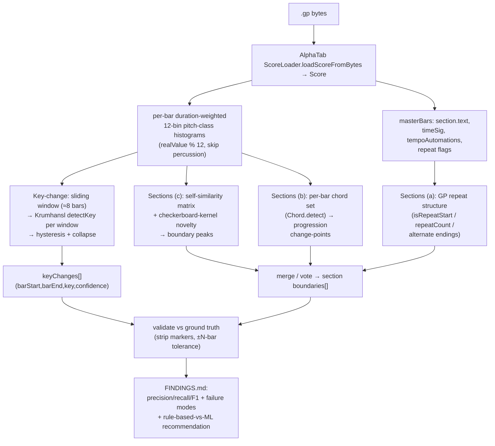

# spike: NH-200 — Smart structure detection (sections + key-change for marker-less songs)

## Summary

A **spike** (exploratory prototype + honest analysis) that, given a parsed song with **no section markers**, infers two things algorithmically:

1. **Section/part approximation** — segment the song into parts using three **rule-based** methods (Guitar Pro repeat structure, chord-progression change-points, bar self-similarity / novelty detection).
2. **Key-change (modulation) timeline** — windowed Krumhansl-Schmuckler key detection + change-point collapse → `keyChanges[]` with `barStart`/`barEnd`.

The deliverable is a self-contained throwaway spike (matching the NH-196 pattern) plus a `FINDINGS.md` carrying an **honest accuracy read** (precision/recall vs ground truth, with boundary tolerance) and a clear **rule-based-vs-ML recommendation**. This is research output, not production code — it must stay out of the workspace build.

---

## Problem Frame

The NH-196 analyzer reads sections/keys **when the file provides them** (finding F9: sections parse for free when present). But some songs carry **no section markers** and **modulate** (change key) mid-song — finding F15 flagged Toto Africa (≈3 keys, no markers) as needing **windowed** detection, and whole-song single-key reads as misleading for such songs. NH-196 designed for this case (design §12 lists "full section approximation for marker-less files" as a satellite) but did not scope or prove it. NH-200 is that proof.

This is an **inference** problem (segmentation + change-point detection), distinct from NH-196's read-what's-there parsing. It has its own approaches and accuracy trade-offs, which is why it is a separate spike.

**Consumers of the output:**
- Feeds NH-196's `sections[]` / `keyChanges[]` when a file has no markers.
- The inferred bar ranges feed NH-137 (song-slice / "From a song" picker).

---

## Requirements

Traced to NH-200:

- **R1 — Key-change timeline.** Produce `keyChanges[]` (`barStart`, `barEnd`, `key`, `confidence`) via windowed Krumhansl-Schmuckler + change-point detection. Single-key songs collapse to one entry; multi-key songs (Africa) yield more than one. (NH-200 goal 2; F15.)
- **R2 — Section approximation, rule-based first.** Segment a marker-less song into parts using (a) GP repeat structure, (b) chord-progression change-points, (c) bar self-similarity / novelty detection. (NH-200 goal 1.)
- **R3 — Honest accuracy read.** Validate against ground-truth files (songs that *do* carry markers, plus the Bohemian Rhapsody marker/marker-less pair) by stripping/ignoring markers, running the approximation, and reporting boundary precision/recall/F1 with an explicit bar tolerance, plus key-change correctness. (NH-200 deliverables.)
- **R4 — Rule-based-vs-ML recommendation.** State whether rule-based is sufficient for v1, where it breaks, and what ML/LLM would add — as a **written recommendation only**, not built here. (NH-200 goal 1 + deliverables.)
- **R5 — Feed-forward fit.** Output naming aligns to NH-196's contract (`SectionSpan`, `KeyChange`, `KeyRef`) so it can plug into the analyzer core and NH-137 later. (NH-200 deliverables; NH-196 design §6.)

Non-functional constraints:
- Self-contained throwaway spike, **not** part of the nx/workspace build (no lint/typecheck/CI coupling) — mirror `docs/spikes/2026-06-19-gp-tonal/`.
- No competitor names anywhere; generic feature language only.
- Honest reporting is the point — document failure modes, no inflated claims.

---

## Key Technical Decisions

- **KTD-1 — Throwaway `.mjs` spike, not workspace TypeScript.** Match NH-196 (`docs/spikes/2026-06-19-gp-tonal/`): a private `package.json`, `.gitignore` for `node_modules`, runnable `.mjs` scripts. Rationale: keeps the spike out of the nx graph so it never couples to lint/typecheck/CI, and keeps iteration fast. The production port (TypeScript, into `core/gp-tonal/`) is a later, separate ticket.
- **KTD-2 — Reuse NH-196's Krumhansl core by reproducing it.** The working `detectKey(hist)` (MAJ/MIN profiles + Pearson correlation + rotate) and the duration-weighted 12-bin pitch-class histogram (`note.realValue % 12`, skipping percussion) live in `docs/spikes/2026-06-19-gp-tonal/spike2.mjs` on the **`alphatab-tonal-spike` branch** (not yet on `master`). Reproduce that small core in a shared `lib.mjs` here so this spike is self-contained on its own branch.
- **KTD-3 — Validation by marker-stripping + boundary tolerance.** Ground truth = files that carry real markers. Ignore their markers when feeding the approximation, then compare predicted boundaries to the real ones with a ±N-bar tolerance (report at ±1 and ±2). For Bohemian Rhapsody, the marker-less file is scored against the separate "with sections" file of the same song. This gives a defensible precision/recall/F1 rather than a vibes read.
- **KTD-4 — Generic, repetition-based section labels.** Label segments by structural class (`A`, `B`, `C` / "repeated block") and bar range, **not** by guessed `intro`/`verse`/`chorus` names beyond what repeat structure clearly supports. Rationale: naming parts is a harder semantic problem; over-claiming names would inflate the accuracy story and risks competitor-flavored language. Honest boundaries + structural classes are the spike's job.
- **KTD-5 — Rule-based only is built; ML/LLM is written analysis.** Per NH-200, build the three rule-based methods, measure them, and only *recommend* ML/LLM in prose with cost/complexity. No model training or LLM calls in this spike.
- **KTD-6 — Change-point hysteresis to avoid flapping.** Windowed key detection over a sliding window will jitter near ambiguous bars. Collapse equal adjacent windows and enforce a minimum segment length (and/or a confidence-margin threshold to switch) so `keyChanges[]` is stable rather than noisy. Exact thresholds tuned against the corpus during work.

---

## High-Level Technical Design



**Self-similarity / novelty (method c), directional sketch — not implementation spec:**
- Per-bar feature vector = the bar's normalized 12-bin pitch-class histogram (optionally concatenated with a coarse rhythm-density scalar).
- Build an N×N bar-to-bar cosine-similarity matrix.
- Slide a small "checkerboard" kernel down the main diagonal; the kernel response is high where the block above-left is internally similar and differs from the block below-right — i.e. a structural boundary.
- Peak-pick the novelty curve (with a minimum spacing) → candidate boundaries.

---

## Output Structure

```
docs/spikes/2026-06-20-smart-structure/
  package.json          # private, type:module, deps: @coderline/alphatab, tonal
  .gitignore            # node_modules
  README.md             # how to run (mirrors NH-196 spike)
  lib.mjs               # shared: load score, per-bar histograms, detectKey (Krumhansl), structure readers
  keychanges.mjs        # R1 — windowed key-change timeline → keyChanges[]
  sections.mjs          # R2 — three rule-based section-approximation methods → boundaries[]
  validate.mjs          # R3 — accuracy harness vs ground truth (precision/recall/F1, key correctness)
  FINDINGS.md           # R3/R4 — honest accuracy read + rule-based-vs-ML recommendation
```

The corpus is **external** to the repo (the user's local music library at `/Users/leocaseiro/Music/AlphaTab-RhythmGame/`). Scripts take a file path argument; `validate.mjs` knows the ground-truth filenames. No audio/score files are committed.

---

## Implementation Units

### U1. Scaffold spike + shared tonal core (`lib.mjs`)

- **Goal:** Stand up the self-contained spike folder and a shared module that loads a score and produces the primitives the other scripts need.
- **Requirements:** Enables R1, R2, R5.
- **Dependencies:** none.
- **Files:** `docs/spikes/2026-06-20-smart-structure/package.json`, `.gitignore`, `README.md`, `lib.mjs`.
- **Approach:**
  - `package.json`: private, `type: module`, deps `@coderline/alphatab` (^1.8.3), `tonal` (^6.4.3); scripts for each `.mjs`. `.gitignore`: `node_modules`.
  - `lib.mjs` exports: `loadScore(path)` (over `ScoreLoader.loadScoreFromBytes`); `perBarHistograms(score)` → array of 12-bin duration-weighted pitch-class vectors built from `note.realValue % 12`, skipping `note.isPercussion`; `detectKey(hist)` reproduced from NH-196 (MAJ/MIN profiles, Pearson, rotate) returning `{ tonic, type, confidence }` shaped toward `KeyRef`; `readStructure(score)` → `{ sections[], timeSignatures[], tempos[], repeats[] }` from master bars (`section.text||marker`, `timeSignatureNumerator/Denominator`, `tempoAutomations`, repeat flags).
  - Align field names to NH-196's contract (`KeyChange`, `SectionSpan`, `KeyRef`) per R5.
- **Patterns to follow:** `docs/spikes/2026-06-19-gp-tonal/spike2.mjs` (histogram + `detectKey`); `docs/spikes/2026-06-19-gp-tonal/package.json` (spike shape).
- **Verification:** `node lib smoke` (or a tiny inline harness) loads a marker-less corpus file, prints bar count and confirms per-bar histograms sum to non-zero for pitched bars; `detectKey` on the whole-song histogram reproduces a known NH-196 value (e.g. I'm Yours → B major).
- **Test expectation:** empirical — corpus smoke run, not a unit-test file (spike posture).

### U2. Windowed key-change timeline (`keychanges.mjs`)

- **Goal:** Produce a stable `keyChanges[]` modulation timeline for a song.
- **Requirements:** R1; R5; F15.
- **Dependencies:** U1.
- **Files:** `docs/spikes/2026-06-20-smart-structure/keychanges.mjs`.
- **Approach:** aggregate per-bar histograms into a sliding window (default 8 bars, hop 1 bar); run `detectKey` per window; apply hysteresis (minimum segment length and/or confidence-margin to switch keys) and collapse equal adjacent windows into spans → `keyChanges[]` of `{ barStart, barEnd, key: { tonic, type }, confidence }`. Emit both JSON and a human-readable timeline. Window size and hysteresis thresholds are tunable constants documented at the top of the file.
- **Patterns to follow:** `detectKey` from U1; NH-196 design §9 (modulation: sliding window → collapse).
- **Test scenarios (empirical, run in `validate.mjs` at U4):**
  - Toto Africa → `keyChanges.length > 1` (multi-key, F15).
  - I'm Yours and Yellow → exactly one key span; tonic B major (sanity vs NH-196 F6/F7).
  - Output spans are contiguous and cover all bars (no gaps/overlaps).
- **Verification:** running on the three marker-less files prints a timeline; Africa shows multiple segments, single-key songs show one.

### U3. Section approximation — three rule-based methods (`sections.mjs`)

- **Goal:** Infer section boundaries for a marker-less song via three independent rule-based signals, then merge them.
- **Requirements:** R2; KTD-4.
- **Dependencies:** U1.
- **Files:** `docs/spikes/2026-06-20-smart-structure/sections.mjs`.
- **Approach:**
  - **(a) GP repeat structure:** read master-bar repeat flags (`isRepeatStart`, `repeatCount`, alternate endings) → structural boundaries at repeat starts/ends. (Exact AlphaTab field names verified at implementation — see Risks.)
  - **(b) Chord-progression change-points:** per-bar chord set via `Chord.detect` on simultaneous non-percussion notes (reuse NH-196 detect-from-notes idea); find bars where the local progression block changes or repeats → boundaries.
  - **(c) Self-similarity novelty:** per-bar feature vector (normalized PC histogram, optional rhythm-density) → cosine self-similarity matrix → checkerboard-kernel novelty curve → peak-pick with minimum spacing → boundaries.
  - **Merge/vote:** combine the three boundary sets into a single ranked candidate list; label segments by structural class (`A`/`B`/… or "repeat of A") and bar range per KTD-4. Each method's raw boundaries also remain individually inspectable (needed for per-method accuracy in U4).
- **Patterns to follow:** NH-196 chord-from-notes cleanup (design §8); novelty/self-similarity is standard MIR (cite in FINDINGS).
- **Test scenarios (empirical, scored in U4):**
  - Each method returns a boundary list (possibly empty for (a) when a file has no repeats).
  - Merged boundaries are sorted, de-duplicated, and within `[1, barCount]`.
  - On a file *with* repeats, method (a) contributes at least the repeat boundaries.
- **Verification:** prints per-method and merged boundaries for each corpus file.

### U4. Validation harness vs ground truth (`validate.mjs`)

- **Goal:** Turn the approximation into an honest, numeric accuracy read.
- **Requirements:** R3.
- **Dependencies:** U2, U3.
- **Files:** `docs/spikes/2026-06-20-smart-structure/validate.mjs`.
- **Approach:**
  - Ground-truth set: files that carry real markers — I'm Yours, Yellow — plus the Bohemian Rhapsody pair (marker-less file scored against the "with sections" file of the same song).
  - For each ground-truth file: read true marker boundaries; run U3 approximation **ignoring** those markers; compute boundary **precision / recall / F1** at ±1 and ±2 bar tolerance, per method and merged.
  - Key-change check: for songs with a known key (NH-196 values) or known modulation (Africa), compare `keyChanges[]` to expectation (single span + correct tonic; or >1 span for Africa).
  - Emit a metrics table (per song × per method × tolerance) to stdout and into a markdown fragment for FINDINGS.
- **Patterns to follow:** standard boundary-detection P/R/F1 with tolerance window.
- **Test scenarios (empirical):**
  - Marker-stripping is correct: the approximation input genuinely contains no section text.
  - Precision/recall computed against a hand-confirmed boundary count for at least one song (sanity that the metric isn't trivially 0 or 1).
  - Bohemian Rhapsody marker-less output is scored against the "with sections" file, not against itself.
- **Verification:** one command prints the full metrics table across the corpus.

### U5. FINDINGS.md — accuracy read + rule-based-vs-ML recommendation

- **Goal:** Write the spike's conclusion: what works, what doesn't, and what to do next.
- **Requirements:** R3, R4, R5.
- **Dependencies:** U4.
- **Files:** `docs/spikes/2026-06-20-smart-structure/FINDINGS.md`.
- **Approach:** mirror NH-196's `FINDINGS.md` style (numbered findings table + corpus table). Include: the metrics table from U4; per-method strengths/failure modes (e.g. where novelty over-segments, where repeats are absent, where windowed key flaps); an **honest** verdict on whether rule-based suffices for v1 and the specific cases it misses; a **rule-based-vs-ML recommendation** with cost/complexity (when an LLM/ML segmenter would earn its keep, what data it needs); and a short "feed-forward" note mapping output to NH-196 `sections[]`/`keyChanges[]` and NH-137 slices (R5).
- **Verification:** FINDINGS states real numbers from the run, names at least the known failure modes, and gives a clear go/defer recommendation for ML.
- **Test expectation:** none — documentation unit.

---

## Scope Boundaries

**In scope:** the four scripts + FINDINGS above; rule-based methods only; validation against the named corpus; honest accuracy + recommendation.

### Deferred to Follow-Up Work
- **Production port** of the proven approach to TypeScript in `core/gp-tonal/` (workspace package) — separate ticket, after NH-196's analyzer core lands.
- **ML/LLM segmenter** — only if U5 recommends it; would be its own spike with a labeled dataset.
- **Full semantic part naming** (intro/verse/chorus/solo) beyond structural classes — harder problem; KTD-4 keeps this spike to boundaries + classes.
- **Mode refinement** in windowed detection (F14, Mixolytian etc.) — inherited from NH-196; not required to prove modulation boundaries.

### Out of scope (this product's identity)
- Real-time/streaming detection; audio (non-symbolic) input. This spike is offline, symbolic (GP/MusicXML) only.

---

## Risks & Dependencies

- **AlphaTab repeat-structure field names.** The exact master-bar properties for repeats/alternate endings must be confirmed against the installed `@coderline/alphatab` type definitions during U3 (candidates: `isRepeatStart`, `repeatCount`, alternate-ending flags). If a field is absent, method (a) degrades to "no structural boundaries" for that file — methods (b)/(c) still run. *Execution-time verification, not a planning blocker.*
- **Ground-truth boundary fidelity.** Marker bars are human-authored and may be approximate; report tolerance at ±1 and ±2 bars rather than exact-match, and treat the numbers as indicative for a spike.
- **Windowed key flapping.** Ambiguous bars cause key jitter; KTD-6 hysteresis mitigates but thresholds need corpus tuning — document the chosen values.
- **Novelty over-segmentation.** Self-similarity can fire on local variation; minimum-spacing peak-pick and the merge/vote step mitigate; failure modes go in FINDINGS.
- **Corpus availability.** Scripts depend on the external local library path; absence simply means the validation run can't execute — note it rather than faking results.
- **Dependency:** conceptually builds on NH-196 (`alphatab-tonal-spike` branch); reproduced locally (KTD-2) so there is no hard branch dependency.

---

## Open Questions

- Window size (default 8 bars) and hysteresis thresholds — resolve empirically during U2.
- Whether to weight the three section methods equally in the merge or rank GP-repeats highest — resolve from U4 per-method accuracy.
- Whether rhythm-density adds signal to the novelty feature vector or just noise — try both in U3, keep what helps.

---

## Sources & Research

- **NH-196 spike** — `docs/spikes/2026-06-19-gp-tonal/` (FINDINGS F1–F16, `spike2.mjs` working `detectKey`), on branch `alphatab-tonal-spike`. First-hand basis for KTD-2.
- **NH-196 design** — `docs/superpowers/specs/2026-06-19-gp-tonal-design.md` (output contract `SectionSpan`/`KeyChange`/`KeyRef`; design §9 modulation; §12 satellites).
- **Krumhansl-Schmuckler** key-finding profiles (the MAJ/MIN weights already in `spike2.mjs`).
- **Self-similarity matrix + checkerboard-kernel novelty** — standard music-structure-analysis technique (cite specifics in FINDINGS).
- **Corpus** — external local library `/Users/leocaseiro/Music/AlphaTab-RhythmGame/`: marker-less `Bohemian Rhapsody.gp`, `Happiness is a Warm Gun.gp`, `Toto - Africa.gp`; ground-truth `Bohemian Rhapsody with sections.gp`, `I'm Yours - Jason Mraz.gp`, `Coldplay-Yellow-06-26-2025.gp`.
