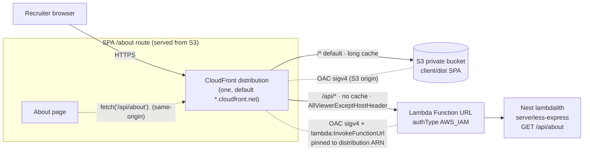

# feat: NH-206 Phase 1 — thin deployable AWS slice (About page end-to-end)

## Summary

Ship the **real, non-throwaway** foundation for Notation Hero on AWS: the NestJS
`server/` app running on Lambda via serverless-express (a "lambdalith"), the `client/`
SPA served as static assets, both fronted by **one CloudFront distribution with two
origins** (ARCH-EDGE-1). The user-visible deliverable is a recruiter-clickable **About
page** (a real SPA route) that calls `GET /api/about` to prove the Lambda leg end-to-end.
This is the zero-refactor base the Phase-2 CMS extends.

**Locked decisions** (Leo, 2026-06-21; AFK best-judgment for the two sub-forks — see origin):

- **Slice shape (c):** serverless-express running the real Nest app on the existing
  `LambdaWithUrl`. No throwaway handler.
- **Architecture (ARCH-EDGE-1, free-tier first):** one CloudFront, `/*` → S3 (SPA, OAC,
  long edge-cache) + `/api/*` → Nest Function URL (AWS_IAM + OAC, no/short cache).
- **Function URL auth = AWS_IAM + CloudFront OAC** (ADR ARCH-LAMBDA-1).

> **Update (post-review, leocaseiro):** the throwaway `GET /api/about` proof endpoint (U2) was
> replaced by a **real** `GET /api/catalog` — the first real feature, returning placeholder
> data now and Neon-backed in Phase 2. The SPA About page renders that live catalog preview.
> The U2 sections below still describe the original `/api/about`; only the endpoint name/shape
> changed (a real listing instead of a stub `about` payload).

---

## Problem Frame

ADR §11 Phase 1 (`docs/decisions/2026-06-17-architecture-decisions.md`) calls for "a thin
deployable AWS slice: an About-page hello-world wired end-to-end (CloudFront → Function URL
→ Lambda)" so a recruiter-clickable artifact exists early (DACI 4-week-pivot guardrail).
PR #56 (NH-199, Phase 0) delivered the skeletons — `LambdaWithUrl` Pulumi component
(`authType: NONE`, inline placeholder), the Vite/TanStack SPA, the NestJS app — but nothing
is wired together or deployed.

Leo's #1 constraint is **AWS $0 free-tier preservation**. Serving static assets from Lambda
(single-origin lambdalith) invokes the function on every cache-miss — more invocations and
GB-seconds. The two-origin shape (S3 + edge cache for static, Lambda only for `/api/*`) is
strictly cheaper and is the already-locked ARCH-EDGE-1.

---

## Scope Boundaries

**In scope (this PR):**

- serverless-express Lambda entry bundling the Nest app.
- A real `GET /api/about` Nest route returning minimal JSON.
- A real `client/` SPA `/about` route that fetches `/api/about`.
- Pulumi: real Lambda bundle + two-origin CloudFront + S3(OAC) + Function-URL AWS_IAM
  lockdown + SPA upload.
- `docs/decisions/decision-registry.md` + ADR/handoff status updates (same PR).
- Local `pulumi up` deploy + live-URL verification (post-CI capstone; needs local creds).

**Deferred to Follow-Up Work** (foundation accommodates them with zero refactor — each its
own ticket; do NOT build here): Dexie data-caching, Cognito sign-in, Sentry, SRE/alerting,
the CMS CRUD itself, a custom domain + ACM cert (CloudFront default `*.cloudfront.net`
domain is fine for Phase 1).

---

## Requirements Traceability

| Req                                                                  | Source                           | Advanced by               |
| -------------------------------------------------------------------- | -------------------------------- | ------------------------- |
| R1 — Nest app runs on Lambda (serverless-express)                    | origin step 1; ADR line 99       | U1                        |
| R2 — real `GET /api/about` route                                     | origin step 3                    | U2                        |
| R3 — SPA About route, recruiter-visible, proves Lambda leg           | origin "About content"; Leo [Q1] | U3                        |
| R4 — Lambda packaged from real bundle, low timeout, arm64, free-tier | ADR §11; Leo free-tier           | U4                        |
| R5 — two-origin CloudFront, S3+OAC, `/api/*` AWS_IAM+OAC lockdown    | ARCH-EDGE-1; ARCH-LAMBDA-1       | U5                        |
| R6 — decision-registry + ADR/handoff updated in same PR              | AGENTS.md "Decision governance"  | U6                        |
| R7 — live public CloudFront URL serves the About page                | origin step 5 (Goal)             | Verification & Deployment |

---

## Key Technical Decisions

- **KTD-1 — Two-origin over single-origin lambdalith.** S3+CloudFront serves the SPA; the
  Lambda serves only `/api/*`. Free-tier optimal (static never invokes Lambda) and is the
  locked ARCH-EDGE-1. Trade-off: more first-deploy Pulumi (one CloudFront, two OACs), done
  once. The Nest app is still a true lambdalith — one Lambda for the whole backend.
- **KTD-2 — Nest global prefix `api`.** Bootstrap sets `setGlobalPrefix('api')` so routes
  answer at `/api/*`, matching the CloudFront `/api/*` behavior that forwards the full path
  to the Function URL. The existing health route therefore moves to `/api/health`.
- **KTD-3 — SWC-based build, CJS output, decorator metadata preserved.** **esbuild cannot
  emit `emitDecoratorMetadata`** (confirmed 2026-06-21) — a naive esbuild-of-TS bundle breaks
  NestJS DI at runtime. Build with **SWC** (the repo already uses it: `.swcrc`,
  `unplugin-swc`, `@swc/core`) so decorator metadata is emitted; produce a single file only by
  running esbuild over **already-SWC-compiled JS** (or an esbuild+SWC plugin) — never
  esbuild-of-TS. Output **CJS** (`exports.handler`), `reflect-metadata` as the first import.
  oRPC is not yet a dependency (its ESM bundling is a Phase-2 concern). Package the artifact
  via Pulumi `FileArchive`.
- **KTD-4 — Function URL `authType: AWS_IAM` + CloudFront OAC (sigv4, confirmed recipe).**
  OAC for the Lambda origin: `originAccessControlOriginType: "lambda"`,
  `signingBehavior: "always"`, `signingProtocol: "sigv4"` (exact @pulumi/aws v7 strings).
  Grant **two** `aws.lambda.Permission` statements to `cloudfront.amazonaws.com` — **both
  `lambda:InvokeFunctionUrl` AND `lambda:InvokeFunction`** (granting only the former causes
  intermittent 403s), each `sourceArn`-pinned to the distribution. Attach the AWS-managed
  origin-request policy **`AllViewerExceptHostHeader`** (id
  `b689b0a8-53d0-40ab-baf2-68738e2966ac`) to the `/api/*` behavior — without it CloudFront
  forwards the viewer Host header and Lambda returns **403 SignatureDoesNotMatch**. Lambda
  origin is HTTPS-only. Drop the wildcard CORS (same-origin via CloudFront removes the need).
- **KTD-5 — SPA upload Pulumi-managed; private S3 via REST endpoint.** Upload built
  `client/dist` to a **private** bucket (Block Public Access ON, Object Ownership _Bucket
  owner enforced_ / ACLs disabled) declaratively (`@pulumi/synced-folder` or per-file
  `BucketObjectv2`). Use the bucket **REST/regional endpoint** as the S3 origin (the website
  endpoint cannot use OAC). `defaultRootObject: "index.html"`. **Custom error responses
  403 → `/index.html` (200)** (load-bearing: a private OAC bucket returns 403, not 404, for a
  missing key — this is what makes SPA deep links work) **and 404 → `/index.html` (200)**.
- **KTD-6 — New Pulumi component `cloudfront-site.stack.ts`.** Keep `LambdaWithUrl` focused;
  add an edge component composing S3+OAC, the Lambda origin+OAC, behaviors, and cache
  policies. `.stack.ts` is the approved infra role suffix.
- **KTD-7 — Pay-as-you-go CloudFront; never attach a flat-rate plan.** The perpetual free
  tier (1 TB out + 10M requests/mo, confirmed still active 2026) applies only to
  pay-as-you-go distributions. The Nov-2025 flat-rate _"Free"_ plan is a trap (100 GB / 1M).
  Create a plain distribution with **no `pricingPlan`/plan association**; leave a code comment
  so no one opts in later.

---

## High-Level Technical Design

The About page is static (S3, edge-cached); its one dynamic call (`/api/about`) is the
same-origin proof that the Lambda leg is live. No CORS needed — everything is one origin.

---

## Implementation Units

### U1. serverless-express Lambda entry + esbuild bundle

**Goal:** the real Nest app boots inside a Lambda handler (cached singleton) and accepts the
Function-URL (API Gateway v2) event payload.
**Requirements:** R1.
**Dependencies:** none.
**Files:**

- `server/src/entry/http.ts` (new — bootstrap Nest once at module scope; export
  serverless-express `handler`; `setGlobalPrefix('api')`; `reflect-metadata` first import)
- `server/src/entry/http.test.ts` (new — co-located)
- `server/package.json` (add dep `@codegenie/serverless-express`; add `build:lambda` script;
  `esbuild` only as a bundler over SWC output if a single-file artifact is wanted)
- `server/build-lambda.mjs` or config (new — SWC-compile for decorator metadata → optional
  esbuild bundle of the compiled JS; CJS output; never esbuild-of-TS)
- `.nvmrc`/runtime stays Node 24 (already)
  **Approach:** `import 'reflect-metadata'` first; bootstrap `NestFactory.create` once at
  module scope; cache the `serverless-express` proxy; export CJS `handler(event, context)`.
  `setGlobalPrefix('api')`. Build via **SWC** (decorator metadata) → CJS; bundle the compiled
  JS with esbuild only if a single file is wanted (never esbuild-of-TS — it strips decorator
  metadata and breaks DI). serverless-express **v5** supports Node 24 + the Function-URL v2.0
  payload natively; pin `eventSourceName: 'AWS_API_GATEWAY_V2'` only if source detection misfires.
  **Patterns to follow:** `server/src/main.ts` (Nest bootstrap), ADR line 99
  (`server/src/entry/http.ts`, cached singleton, `@codegenie/serverless-express`).
  **Execution note:** Start with a failing handler test (invoke `handler` with a synthetic
  API-GW-v2 GET event for `/api/health`, expect 200).
  **Test scenarios** (`server/src/entry/http.test.ts`):
- Covers R1. Invoking `handler` with an API-GW-v2 v2 event for `GET /api/health` returns
  statusCode 200 and the health body.
- A second invocation reuses the cached app instance (no re-bootstrap) — assert the factory
  runs once across two calls.
- An unknown path (`GET /api/nope`) returns 404 through the Nest router.
- DI guard: the `/api/health` route (an injected provider) responds 200 through the **real
  SWC build** — proves decorator metadata survived bundling (catches the esbuild-DI trap).
  **Verification:** `pnpm --filter @notation-hero/server run build:lambda` emits a single
  bundle; the handler test passes under Vitest.

### U2. About API route (`GET /api/about`)

**Goal:** a real Nest route returns minimal About JSON.
**Requirements:** R2.
**Dependencies:** U1 (prefix) — buildable independently; wire order only.
**Files:**

- `server/src/modules/about/about.controller.ts` (new)
- `server/src/modules/about/about.controller.spec.ts` (new — co-located, `.spec.ts` mirrors
  the health module)
- `server/src/modules/about/about.module.ts` (new)
- `server/src/app.module.ts` (import `AboutModule`)
  **Approach:** `@Controller('about')` (global prefix `api` makes it `/api/about`) returning a
  small static payload: app name, phase, a short tagline, and `now` timestamp (proves dynamic
  execution). No service layer needed unless trivially useful; keep minimal (Simplicity First).
  Respect the hexagon — this is a `modules/` controller; no `core/` purity concern.
  **Patterns to follow:** `server/src/modules/health/health.controller.ts` +
  `health.controller.spec.ts`.
  **Test scenarios** (`about.controller.spec.ts`):
- Covers R2. `GET /api/about` returns 200 and a JSON body containing the app name and phase
  fields.
- The response includes a timestamp that differs between two calls (proves it is computed,
  not a frozen literal).
  **Verification:** controller spec passes; `pnpm --filter @notation-hero/server run test`
  green; the route appears under `/api/about` when bundled (covered by U1 handler test path).

### U3. SPA About route (`/about`) calling the API

**Goal:** a recruiter-visible About page as a real SPA route that fetches `/api/about`.
**Requirements:** R3.
**Dependencies:** U2 (the endpoint it calls) — can be built against a mocked fetch.
**Files:**

- `client/src/routes/about.tsx` (new — TanStack Router route)
- `client/src/routes/about.test.tsx` (new — co-located, Vitest + Testing Library)
- `client/src/routeTree.gen.ts` (regenerated via `pnpm --filter @notation-hero/client run
generate-routes`)
- optionally `client/src/routes/__root.tsx` (add an About nav link)
  **Approach:** Minimal real content (what Notation Hero is, one line on the stack), plus a
  small panel that calls `/api/about` (same-origin relative URL, works behind CloudFront) and
  renders the returned name/phase/timestamp — the visible "the Lambda is live" proof. Use
  TanStack Query (already a dep) or a plain `useEffect` fetch; prefer Query for the endgame.
  Loading + error states kept minimal but present.
  **Patterns to follow:** `client/src/routes/index.tsx`, `client/src/components/Home.tsx` +
  `Home.test.tsx`.
  **Test scenarios** (`client/src/routes/about.test.tsx`):
- Covers R3. Renders the About heading and static copy.
- With `/api/about` mocked to a success payload, the page shows the returned name/phase.
- With `/api/about` mocked to fail, the page shows a graceful fallback (not a crash/blank).
  **Verification:** `pnpm --filter @notation-hero/client run test` green; `pnpm --filter
@notation-hero/client run build` produces `client/dist` with the About route.

### U4. Infra — package the real Lambda bundle

**Goal:** the Pulumi Lambda runs the real Nest bundle (not the inline placeholder), tuned for
free-tier.
**Requirements:** R4.
**Dependencies:** U1 (the bundle exists).
**Files:**

- `infra/index.ts` (swap inline `StringAsset` → `FileArchive("../server/dist-lambda")`;
  handler `http.handler`; pass `timeoutSeconds` low)
- `infra/lambda-with-url.stack.ts` (parameterize `authType` + `cors` + `timeoutSeconds`;
  default keeps current behavior, see U5 for the AWS_IAM flip)
- `infra/lambda-with-url.stack.test.ts` (extend — assert handler + timeout + bundle wiring)
  **Approach:** Add `timeoutSeconds` (e.g. 10) and `memorySize` (e.g. 256/512) args; arm64
  already set. Keep `loggingConfig` + managed LogGroup. Reference the bundle via repo-relative
  `FileArchive`. Do NOT yet flip auth (U5 owns the OAC wiring so the permission can pin the
  distribution ARN that doesn't exist until U5).
  **Patterns to follow:** existing `LambdaWithUrl` component + its Pulumi-mocks test.
  **Test scenarios** (`infra/lambda-with-url.stack.test.ts`):
- The function's `handler` is `http.handler` and `runtime`/`architectures` are node24/arm64.
- `timeoutSeconds` is applied (low value), proving the free-tier guard is wired.
- The managed LogGroup name stays `/aws/lambda/<functionName>`.
  **Verification:** `pnpm --filter @notation-hero/infra run test` green; `pulumi preview`
  plans the function with the file-archive code (no diff errors).

### U5. Infra — two-origin CloudFront, S3+OAC, Function-URL AWS_IAM lockdown

**Goal:** one CloudFront distribution fronting S3 (SPA) and the Lambda Function URL (`/api/*`),
with the Function URL locked to CloudFront.
**Requirements:** R5.
**Dependencies:** U3 (built SPA to upload), U4 (the Lambda + Function URL).
**Files:**

- `infra/cloudfront-site.stack.ts` (new component — S3 private bucket + public-access-block;
  CloudFront OAC for S3; CloudFront OAC for the Lambda origin; distribution with default
  `/*`→S3 behavior + ordered `/api/*`→Function-URL behavior; cache policies; SPA error
  responses; default root object)
- `infra/cloudfront-site.stack.test.ts` (new — Pulumi mocks)
- `infra/index.ts` (instantiate the component; flip `LambdaWithUrl` `authType: AWS_IAM`,
  drop wildcard CORS; add `aws.lambda.Permission` for `cloudfront.amazonaws.com` pinned to
  the distribution ARN; export the CloudFront URL)
- `infra/package.json` (add `@pulumi/synced-folder` if used for the SPA upload — keep
  syncpack consistent)
  **Approach:** Private S3 bucket (block all public access); bucket policy grants
  `cloudfront.amazonaws.com` `s3:GetObject` scoped to the distribution ARN. Two OACs (sigv4):
  one for the S3 origin, one for the Lambda Function URL origin. Default behavior `/*` → S3,
  `CachingOptimized`-style long TTL, `index.html` default root object, 403/404 → `/index.html`
  (200). Ordered behavior `/api/*` → Function-URL origin, `CachingDisabled`, all viewer methods,
  origin-request policy `AllViewerExceptHostHeader` (id `b689b0a8-53d0-40ab-baf2-68738e2966ac`).
  Upload `client/dist` (KTD-5). Add **two** `aws.lambda.Permission`s (`lambda:InvokeFunctionUrl`

* `lambda:InvokeFunction`) for `cloudfront.amazonaws.com` pinned to the distribution ARN. OAC
  strings: origin types `s3`/`lambda`, `signingBehavior: always`, `signingProtocol: sigv4`. S3
  origin uses the **REST** endpoint; Lambda origin HTTPS-only. **No CloudFront pricing plan**
  (stay pay-as-you-go — KTD-7). Pulumi ordering: OAC + FunctionUrl → distribution →
  `lambda.Permission`s referencing `distribution.arn`.
  **Patterns to follow:** `LambdaWithUrl` component structure (ComponentResource,
  `registerOutputs`); the Pulumi-mocks test harness in `lambda-with-url.stack.test.ts`.
  **Test scenarios** (`infra/cloudfront-site.stack.test.ts`):

- The S3 bucket blocks public access and its policy principal is `cloudfront.amazonaws.com`
  scoped to a distribution ARN (no `*` principal).
- The distribution has exactly two origins (S3, Function-URL) and an ordered `/api/*`
  behavior distinct from the default `/*` behavior.
- The `/api/*` behavior disables caching and uses the `AllViewerExceptHostHeader` origin
  request policy; the `/*` behavior caches.
- Custom error responses map 403 and 404 to `/index.html` with response code 200.
- Two `aws.lambda.Permission`s grant `lambda:InvokeFunctionUrl` and `lambda:InvokeFunction`
  to `cloudfront.amazonaws.com`, each with a non-wildcard `sourceArn`.
- The Function URL `authorizationType` is `AWS_IAM` (regression guard on the lockdown).
- The Lambda-origin OAC uses `originAccessControlOriginType: "lambda"`, `signingBehavior:
"always"`, `signingProtocol: "sigv4"`.
  **Verification:** `pnpm --filter @notation-hero/infra run test` green; `pulumi preview`
  plans the full graph with no errors; `pnpm run depcheck` / `check:layout` stay green for
  `infra/`.

### U6. Decision registry + ADR/handoff status updates

**Goal:** record the enforcement/infra change in the same PR (AGENTS.md governance rule).
**Requirements:** R6.
**Dependencies:** U5 (what's enforced is now real).
**Files:**

- `docs/decisions/decision-registry.md` (Change-log entry dated 2026-06-21: Phase 1 slice
  shipped, ARCH-EDGE-1 + ARCH-LAMBDA-1 now realized in code; flip their status/enforcement
  markers as appropriate)
- `docs/decisions/2026-06-17-architecture-decisions.md` (mark §11 Phase 1 underway/done; note
  the live URL once captured)
- `docs/prompts/2026-06-21-phase1-deployable-aws-slice-prompt.md` (tick steps as done; record
  the live URL)
  **Approach:** Follow the registry's existing Change-log format and status glyphs
  (⏳→✅, 📄→🤖). Keep edits surgical.
  **Test scenarios:** Test expectation: none — documentation only.
  **Verification:** registry Change-log has the dated entry; statuses reflect reality; links
  resolve.

---

## Verification & Deployment (post-CI capstone)

Runs **after** the PR is green (needs local AWS creds + Pulumi token; never CI):

1. `pnpm install` in the worktree (lefthook installed); build `server` bundle + `client` dist.
2. `pnpm --filter @notation-hero/infra run pulumi:preview` — confirm the plan.
3. `pnpm --filter @notation-hero/infra run pulumi:up` — deploy (CloudFront ~5–15 min).
4. `curl` the CloudFront URL root (SPA `index.html` 200) and `/api/catalog` (JSON 200); open
   the About page; confirm the page renders the live `/api/catalog` data.
5. Confirm the raw `*.lambda-url` returns 403 directly (lockdown proof).
6. Capture the live URL into U6 docs + the Jira ticket; `pulumi:destroy` is the rollback.

> If creds/token turn out unavailable at capstone time, hand Leo the exact two commands
> (`pulumi:preview` then `pulumi:up`) and the verification curls; do not block the PR on it.

---

## Risks & Mitigations

- **NestJS DI breakage from naive esbuild.** esbuild cannot emit decorator metadata → broken
  DI at runtime. _Mitigation (resolved):_ build via SWC (KTD-3); `reflect-metadata` first; the
  U1 handler test invokes a DI-backed route (`/api/health`) against the real build to catch it.
- **Host-header 403 on the Lambda origin.** Forwarding the viewer Host breaks SigV4 →
  403 SignatureDoesNotMatch. _Mitigation (resolved):_ attach `AllViewerExceptHostHeader` to
  `/api/*` (KTD-4); grant both invoke permissions; `pulumi preview` validates the graph.
- **OAC + `AWS_IAM` rejects unsigned POST/PUT bodies.** GET works; writes can 403 unless the
  viewer signs the body. _Mitigation:_ Phase 1 is GET-only (`/api/about`). Flagged for the
  Phase-2 CMS (writes) — revisit signing or an alternate write path then.
- **CloudFront flat-rate "Free" plan trap (Nov 2025).** Opting in silently caps at 100 GB / 1M.
  _Mitigation:_ plain pay-as-you-go distribution, no plan association (KTD-7).
- **`check:layout` role-suffix on the entry file.** `server/src/entry/http.ts` may not match
  an allowed role suffix. _Mitigation:_ run `pnpm run check:layout` early in U1; if it
  rejects, adjust the guard's vocabulary (ADR-sanctioned path) or rename minimally — flag in
  the PR.
- **`/api` prefix alignment.** CloudFront behavior, Function URL path, and Nest global prefix
  must agree. _Mitigation:_ KTD-2 fixes the prefix; U1 handler test asserts `/api/health`.
- **SPA upload + cache invalidation.** Stale assets after redeploy. _Mitigation:_ content-
  hashed Vite filenames + CloudFront invalidation of `/index.html` on deploy.
- **Deploy is outward-facing.** Creates real (free-tier) AWS resources. _Mitigation:_ deploy
  is a clearly-separated capstone after review/CI; reversible via `pulumi:destroy`.

---

## Sources & Research

- Origin handoff: `docs/prompts/2026-06-21-phase1-deployable-aws-slice-prompt.md` (slice (c)
  locked; agent resolutions appended).
- ADR: `docs/decisions/2026-06-17-architecture-decisions.md` — §11 Phase 1; ARCH-EDGE-1
  (one CloudFront, two origins); ARCH-LAMBDA-1 (Function URL AWS_IAM + OAC).
- Conventions: `AGENTS.md` (hexagon fence, co-located Vitest tests, role-suffix layout,
  Pulumi local-only, decision-registry governance, PR checklist).
- Prior art: `docs/plans/2026-06-13-001-feat-kan-119-pulumi-hello-world-plan.md` (the earlier
  bare Function-URL hello-world), `infra/lambda-with-url.stack.ts` + its Pulumi-mocks test.
- Confirmed (background `ce-best-practices-researcher`, 2026-06-21): CloudFront 1 TB/10M
  perpetual free tier still active (avoid the Nov-2025 flat-rate plan); OAC-for-Function-URL
  GA recipe (`lambda`/`always`/`sigv4` + dual invoke permission + `AllViewerExceptHostHeader`
  `b689b0a8-…`); S3+OAC private-bucket pattern (REST endpoint, ACLs disabled, 403→index.html);
  `@codegenie/serverless-express` v5 (Node 24, Function-URL v2.0 payload, **SWC-not-esbuild**
  for decorator metadata, prefer CJS). Folded into KTD-3/4/5/7 + U1/U5.
