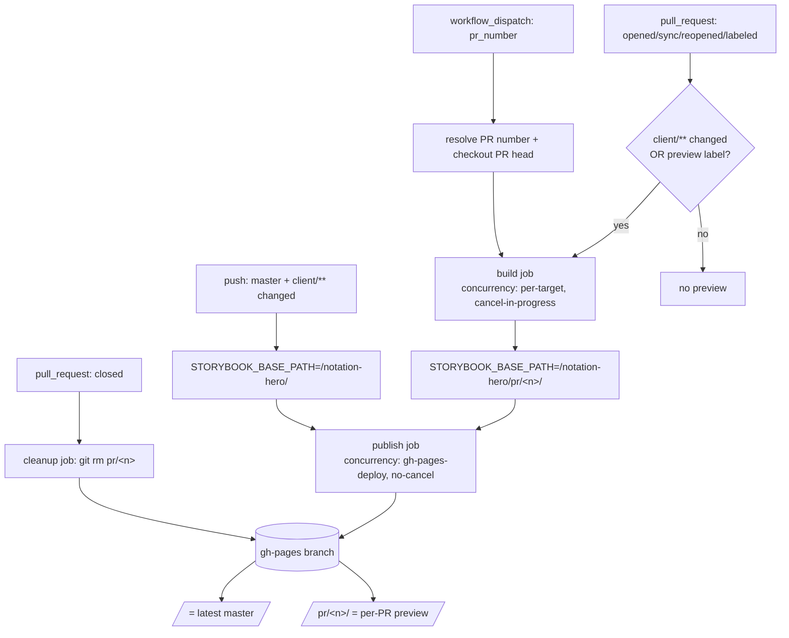

# feat: Storybook PR preview on GitHub Pages (per-PR + latest master)

**Origin spec:** `docs/specs/2026-07-05-storybook-pr-preview-design.md`
**Depth:** Standard · **Type:** feat · **Branch:** `claude/mystifying-haslett-c1856b`
**Supersedes the spec's open "mechanism" question:** hand-rolled `peaceiris/actions-gh-pages`, not `rossjrw/pr-preview-action` (see KTD1).

---

## Summary

Add a GitHub Actions workflow that builds Storybook and publishes it to the `gh-pages` branch of this
public repo: each PR's preview at `/pr/<number>/` and the latest `master` build at the site root. Builds run
automatically when `client/**` changes, plus two manual triggers (a `preview` label and a `workflow_dispatch`
button). No secrets or AWS credentials touch any PR, and the workflow is not a required merge check.

The work is three artifacts: a base-path override in `client/.storybook/main.ts`, the new workflow file, and
developer docs. External research (2026-07-05) resolved the publish mechanism and the Storybook-under-a-subpath
approach; both are load-bearing and cited under Sources.

---

## Problem Frame

Storybook is fully static (Vite build), so it can be hosted on GitHub Pages for free on a public repo. Today
the only way to view a PR's Storybook is to run it locally. The goal is a click-to-open URL per PR plus a
stable public showcase of the latest `master` Storybook — without weakening the NH-206 rule that PRs carry no
AWS credentials.

Two facts from research shape the whole design:

1. **The publish target must be the classic `gh-pages` branch**, not the `actions/deploy-pages` artifact model.
   The artifact model replaces the entire site per deploy; per-PR folders that accumulate and are removed
   individually are a branch-content problem (KTD2).
2. **The exact `/pr/<number>/` bare-number path rules out `rossjrw/pr-preview-action`**, whose inner folder is a
   hardcoded `pr-<n>` string literal (KTD1). We hand-roll with `peaceiris/actions-gh-pages`.

---

## Requirements

Traced from the origin spec:

- **R1** — Per-PR preview served at `/pr/<number>/` (inner folder is the bare PR number, no `pr-` prefix).
- **R2** — Latest `master` Storybook served at the site root `/`.
- **R3** — Auto-build only when `client/**` changed; `server/**`, `infra/**`, and docs-only PRs do not trigger it.
- **R4** — Manual trigger: a `preview` label builds a preview for any PR, even one that did not touch `client/**`.
- **R5** — Manual trigger: `workflow_dispatch` with a `pr_number` input builds any PR by number, no new commit.
- **R6** — No cross-PR overlap: each PR writes only its own folder, sibling previews and the root are preserved,
  and concurrent publishes serialize instead of racing the shared branch.
- **R7** — Every push to a PR rebuilds and republishes to the same stable `/pr/<number>/` URL; rapid same-PR
  pushes supersede (cancel) the older in-flight build.
- **R8** — On PR close, that PR's folder is removed so previews do not accumulate.
- **R9** — No secrets or AWS credentials on any PR (`pull_request`, not `pull_request_target`; build has no
  secrets); the workflow is not in the `ci-green` required-checks list (no merge deadlock when it skips).
- **R10** — The preview URL is posted as a single sticky comment on the PR (updated in place on each push).

---

## Key Technical Decisions

**KTD1 — Hand-roll with `peaceiris/actions-gh-pages@v4`, not `rossjrw/pr-preview-action`.**
`rossjrw` is well-maintained but constructs its path as `"$umbrella_path/pr-$pr_number"` — the `pr-` prefix is
a hardcoded literal with no input to strip it, so `umbrella-dir: pr` yields `pr/pr-123/`, never `pr/123/`.
Meeting R1 with `rossjrw` would require forking it. `peaceiris` gives exact control via
`destination_dir: pr/<number>`. Cost: we hand-write the sticky comment (R10) and the cleanup-on-close (R8),
which `rossjrw` would have done automatically.

**KTD2 — Classic branch-based Pages (`gh-pages`), source = "Deploy from a branch".**
Forced by the accumulation requirement (R1, R2, R6). The `actions/deploy-pages` artifact model cannot host
independently-added/removed per-PR folders. One-time manual enablement by leocaseiro (see Dependencies).

**KTD3 — Storybook base path via a `viteFinal` env override; default `/`.**
Storybook v10 has no `--base` CLI flag. The existing `viteFinal` in `client/.storybook/main.ts` (added for
Tailwind) is extended to set Vite `config.base` from `STORYBOOK_BASE_PATH`, defaulting to `/`. Because the
default is `/`, the existing `dev`, `a11y`, `vr`, and `build` flows are unaffected — only the preview workflow
sets the env var (`/notation-hero/` for root, `/notation-hero/pr/<n>/` for a PR).

**KTD4 — Two concurrency groups on different keys.**
Neither `peaceiris` nor `rossjrw` retries on a non-fast-forward push, so `concurrency` is the only race
mitigation. The build job keys on the resolved TARGET, from an expression over event context available at
job-config time — NOT `github.ref` (which aliases `workflow_dispatch` and `push`-master onto one key, so a
dispatched preview and a root build would cancel each other), and NOT a step output (the job-level
`concurrency.group` is evaluated before steps run):
`group: storybook-preview-${{ github.event.pull_request.number || github.event.inputs.pr_number || 'master' }}`
with `cancel-in-progress: true` — a PR (auto or dispatched) supersedes only its own in-flight build; master
supersedes only master (same-target supersede, R7). The publish job uses a shared `group: gh-pages-deploy`,
`cancel-in-progress: false` (cross-PR serialize, R6). They must be separate jobs because one job can hold only
one concurrency group.

**KTD5 — `keep_files` semantics.**
Root (master) publish: `keep_files: true` so rebuilding the root does not delete the `/pr/*` subtree. PR
publish: `destination_dir: pr/<n>` with default `keep_files: false` — `peaceiris` scopes deletion to the
destination dir, so sibling PR folders and the root are preserved automatically while the PR's own folder is
refreshed.

**KTD6 — Plain `pull_request` + `contents: write` + `GITHUB_TOKEN`; no fork support yet.**
The build has no secrets, so the canonical safe pattern applies. Same-repo branch PRs get a writable token and
publish; fork PRs get a read-only token and fail closed (acceptable for a solo repo). The `workflow_run` split
for fork previews is deferred (Scope Boundaries). Keeps the NH-206 posture (R9). Trust boundary: `workflow_dispatch`
builds untrusted PR code (`refs/pull/<n>/head`) with the writable token, but GitHub restricts who can dispatch
to users with repo write access — so today only leocaseiro can trigger it; re-evaluate this assumption if
write-access collaborators or automation are added.

**KTD7 — Not a required check.**
The workflow is separate from `ci.yml` and absent from the `ci-green` `needs:` list, so skipping on a
non-`client` PR never deadlocks merge (R9).

---

## High-Level Technical Design

Layout on `gh-pages`: `/index.html` (latest master) + `/pr/<n>/` per open PR. See the origin spec for the
tree.

---

## Implementation Units

### U1. Storybook base-path override

**Goal:** Let the Storybook build serve correctly from a subpath, driven by an env var, defaulting to `/`.
**Requirements:** R1, R2.
**Dependencies:** none.
**Files:** `client/.storybook/main.ts`.
**Approach:** Extend the existing `viteFinal` hook to merge `base: process.env.STORYBOOK_BASE_PATH ?? '/'`
alongside the current Tailwind plugin merge. No `--base` CLI flag exists in v10 (KTD3). Default `/` keeps
`dev`, `a11y`, `vr`, and `build` unchanged.
**Patterns to follow:** the current `mergeConfig(cfg, { plugins: [tailwindcss()] })` in the same file — add
`base` to that merged object.
**Test scenarios:**

- Build with `STORYBOOK_BASE_PATH=/notation-hero/pr/123/` → built `index.html` / `iframe.html` reference
  assets under that prefix (e.g. `/notation-hero/pr/123/assets/...`), not `/assets/...`.
- Build with the env var unset → base is `/` and asset references match today's output (no regression).
- `Covers R1, R2.` Verification is by inspecting built output (grep for the prefixed asset URLs); there is no
  unit-test harness for Storybook's build config, so U2 adds a grep assertion step in CI to lock this.

### U2. Preview workflow — build + publish (per-PR and root)

**Goal:** The core workflow: triggers, path filter, base-path build, and the two publish paths with correct
isolation and concurrency.
**Requirements:** R1, R2, R3, R4, R5, R6, R7, R9.
**Dependencies:** U1.
**Files:** `.github/workflows/storybook-preview.yml` (new).
**Approach:**

- **Triggers:** `pull_request` (`opened`, `synchronize`, `reopened`, `labeled`); `workflow_dispatch` (input
  `pr_number`); `push` to `master`. (`closed` cleanup is U4.)
- **`changes` job** (`dorny/paths-filter`, mirroring `ci.yml`) → outputs `client` for `client/**` plus this
  workflow's own path. Gated `if: github.event_name == 'pull_request' || github.event_name == 'push'` — NOT
  run on `workflow_dispatch`, where the filter has no diff base (F2). Copy `ci.yml`'s pinned
  `dorny/paths-filter` SHA, not a floating `@v4`.
- **Resolve PR number + base path:** a small step computes the number from `github.event.pull_request.number`
  (PR events), the `pr_number` input (dispatch), or none (master → root). Dispatch also checks out
  `refs/pull/<n>/head`.
- **Build job** — `concurrency` keyed per KTD4
  (`storybook-preview-${{ github.event.pull_request.number || github.event.inputs.pr_number || 'master' }}`,
  `cancel-in-progress: true`). The build `if:` must NOT depend on the `changes` output for the dispatch/label
  paths (the filter did not run on dispatch):
  `github.event_name == 'workflow_dispatch' || needs.changes.outputs.client == 'true' || (github.event_name == 'pull_request' && contains(github.event.pull_request.labels.*.name, 'preview'))`
  (R3/R4/R5). Uses `./.github/actions/setup-js` (the repo's pnpm+Node composite), sets `STORYBOOK_BASE_PATH`,
  runs `pnpm --filter @notation-hero/client run build-storybook`, asserts the base path applied (grep, locking
  U1), and uploads `client/storybook-static` as an artifact.
- **Publish job** — `needs: build`, `concurrency: { group: gh-pages-deploy, cancel-in-progress: false }`
  (KTD4, R6). Downloads the artifact and runs `peaceiris/actions-gh-pages` (SHA-pinned — see below):
  - PR path: `destination_dir: pr/<number>`, default `keep_files` (KTD5, R1/R6).
  - master path: no `destination_dir` (root), `keep_files: true` (KTD5, R2).
- **Permissions:** `contents: write` (publish) + `pull-requests: write` (U3 comment) only; `GITHUB_TOKEN`
  (KTD6, R9).
- **SHA-pin every third-party `uses:` to a full commit SHA** — no floating tags; the `@v4` references in this
  plan are shorthand. Pin `peaceiris/actions-gh-pages`, `actions/github-script`, and the copied
  `dorny/paths-filter` at implementation. No CI check currently fails a floating tag (`actionlint` does not
  enforce pins), so this is a manual gate (S2).
- **Not added to `ci-green`** (KTD7, R9).
  **Patterns to follow:** `ci.yml` `changes` job (paths-filter + `ci-green` "skipped is OK"); `deploy.yml`
  SHA-pinning; `.github/actions/setup-js` for toolchain setup.
  **Test scenarios:**
- `actionlint` (already a `ci.yml` lint step) parses the new workflow with no errors — expression syntax,
  job graph, and `uses:` pins valid.
- YAML lint + prettier clean.
- Live smoke on this PR: because this PR touches `client/**`, the workflow runs, builds, and pushes
  `pr/<this-PR-number>/` to `gh-pages` (branch auto-created on first push). `Covers R1, R3, R6, R7.`
- `preview` label on a non-`client` PR triggers a build (the `changes` disjunct is false but the label
  disjunct fires). `Covers R4.`
- `workflow_dispatch` with a `pr_number` input checks out that PR's head and publishes `pr/<n>/`; two
  dispatches for different PRs do NOT cancel each other (distinct concurrency keys, F1). `Covers R5.`
- Inspect the merged workflow: trigger is `pull_request` (not `pull_request_target`), no `secrets.*` are
  referenced in the build, and the workflow is absent from `ci-green`'s `needs:`. `Covers R9.`
- Master path validated post-merge (root publish with `/pr/*` preserved). `Covers R2.`
- `Test expectation: no unit harness — verification is actionlint + the live PR/master/dispatch runs above.`

### U3. Sticky PR comment with the preview URL

**Goal:** Post/update one comment per PR carrying the `/pr/<number>/` URL (R10).
**Requirements:** R10.
**Dependencies:** U2.
**Files:** `.github/workflows/storybook-preview.yml` (add a step).
**Approach:** After a successful PR publish, use `actions/github-script` (first-party, SHA-pinned) to upsert a
comment identified by a hidden marker (`<!-- storybook-preview -->`): find the bot's existing marked comment
and update it, else create it. Avoids a new comment per push. The comment step is guarded
`if: github.event_name == 'pull_request' || github.event_name == 'workflow_dispatch'` (a PR number exists); the
`push`-master root publish skips it entirely (no PR to comment on, F3).
`marocchino/sticky-pull-request-comment` is the lighter alternative but is another third-party dependency to
vet — deferred (Scope Boundaries).
**Patterns to follow:** `permissions: pull-requests: write` scoped to this workflow; keep the marker stable.
**Test scenarios:**

- First push to a PR → exactly one preview comment appears with the correct `/pr/<number>/` URL.
- Second push to the same PR → the same comment is updated in place (no duplicate). `Covers R10.`
- `Test expectation: verified on the live PR run (github-script has no local harness).`

### U4. Cleanup on PR close + developer docs

**Goal:** Remove a PR's folder when it closes (R8) and document the feature.
**Requirements:** R8, plus developer-facing documentation.
**Dependencies:** U2 (and U3 for the comment update).
**Files:** `.github/workflows/storybook-preview.yml` (add `closed` trigger + cleanup job); `client/README.md`;
`AGENTS.md`.
**Approach:**

- **Cleanup job** — on `pull_request` `closed`: check out `gh-pages`, `git rm -r --ignore-unmatch pr/<number>`,
  commit, and push under the shared `gh-pages-deploy` concurrency group (KTD4). Update the sticky comment to
  note the preview was removed. `peaceiris` has no auto-teardown, so this is hand-written (KTD1). Permissions
  match U2 (`contents: write` + `pull-requests: write` only); a fork-PR close (read-only token, never had a
  preview) is a no-op, consistent with the "PR that never had a preview" scenario below.
- **Docs** — a short section in `client/README.md` (how previews work, the two manual triggers, the URL shape)
  and a pointer in `AGENTS.md`, including the one-time Pages enablement step (Dependencies). The design-system
  convention keeps dev docs in `client/README.md` + `AGENTS.md`.
  **Patterns to follow:** existing `client/README.md` Storybook/CI sections; `AGENTS.md` CI notes.
  **Test scenarios:**
- Closing a PR whose preview exists → `pr/<number>/` is gone from `gh-pages`; sibling previews and root remain.
  `Covers R8.`
- Closing a PR that never had a preview → cleanup is a no-op (the `--ignore-unmatch` guard), job succeeds.
- Docs pass markdownlint + cspell + prettier.
- `Test expectation: cleanup verified on the live PR-close event; docs are non-behavioral (lint only).`

---

## Scope Boundaries

**In scope:** the base-path override, the preview workflow (build + PR/root publish + comment + cleanup +
manual triggers), and developer docs.

### Deferred to Follow-Up Work

- **Fork-PR previews** via the `pull_request` build + `workflow_run` privileged-publish split (KTD6) — only
  needed when external contributors open PRs.
- **`marocchino/sticky-pull-request-comment`** as a lighter comment mechanism than `github-script` (U3) — a
  third-party action to vet first.
- **Adding `shared/` to the auto-trigger path filter** — do this if stories begin rendering `shared/` code or
  types (origin spec open question).

### Out of Scope (unchanged by this work)

- **Custom domain** (`notationhero.com`) for Storybook — the `github.io` URL is the target; avoid paid DNS.
- **Playwright `vr` / `a11y` jobs** — untouched (KTD3 keeps base `/` for them).
- **The AWS-hosted SPA** (`deploy.yml` → S3 + CloudFront) — the Pages Storybook is a separate showcase.

---

## Risks & Dependencies

**Dependencies (one-time, manual — leocaseiro):** enable Pages at **Settings → Pages → Deploy from a branch →
`gh-pages` / root** (KTD2). The workflow can run and create the `gh-pages` branch before this is set, but URLs
404 until it is on. Not a merge blocker (KTD7).

**Risks:**

- **R-builder-base** — builder-vite has a history of partial/inconsistent `base` honoring on some asset types
  (tracked against Storybook 7; v10 status unconfirmed). _Mitigation:_ the U2 grep assertion + a manual visual
  check of the first deployed `/pr/<n>/` preview for broken assets before trusting it.
- **R-concurrency-drop** — a shared concurrency group keeps only one _pending_ run, so a burst of near-
  simultaneous cross-PR pushes can drop an intermediate deploy. _Accepted:_ folders are append-only "latest
  state"; the next push to that PR re-converges.
- **R-peaceiris-beta** — `destination_dir` is beta-labeled with one open `EACCES` report involving a nested
  `.git` in the source dir. _Mitigation:_ not applicable to a plain `storybook-static` output; verify once on
  the live run.
- **R-first-run** — `gh-pages` does not exist initially; `peaceiris` creates it on first push. Let this PR's
  own `client/**` build be the single branch-seeding publish before any concurrent root/PR publish, so two
  first-run publishes don't race branch creation (F4).

---

## Sources & Research

External research 2026-07-05 (all fetched that date):

- `rossjrw/pr-preview-action` path is hardcoded `pr-<n>` — verified in
  `raw.githubusercontent.com/rossjrw/pr-preview-action/main/lib/main.sh`; maintenance via releases/commits
  (latest v1.8.1 Jan 2025, commits through Apr 2026). Requires "Deploy from a branch".
- `peaceiris/actions-gh-pages@v4` (v4.1.0, May 2026) — `destination_dir` + `keep_files` semantics from its
  README and issue #324.
- `GITHUB_TOKEN` fork demotion + `pull_request` vs `pull_request_target` safety —
  `docs.github.com/actions/concepts/security/github_token` and secure-use reference.
- Concurrency: one pending run per group, `cancel-in-progress` semantics —
  `docs.github.com/actions/.../control-workflow-concurrency`.
- Storybook v10 has no `--base` CLI flag; `viteFinal` `config.base` override is the current API —
  `storybook.js.org/docs/api/cli-options` and `.../main-config/main-config-vite-final`. Partial-base history:
  storybook issue #21627 (unconfirmed for v10).
- GitHub Pages branch vs artifact models both supported in 2026; artifact model cannot accumulate per-PR
  folders — `docs.github.com/pages/.../configuring-a-publishing-source-...`.

---

## Open Questions

- **`shared/**`in the path filter** — deferred until stories consume`shared/` (see Scope Boundaries).
- **Jira** — no NH ticket yet; create one to track if desired (not required to implement).
