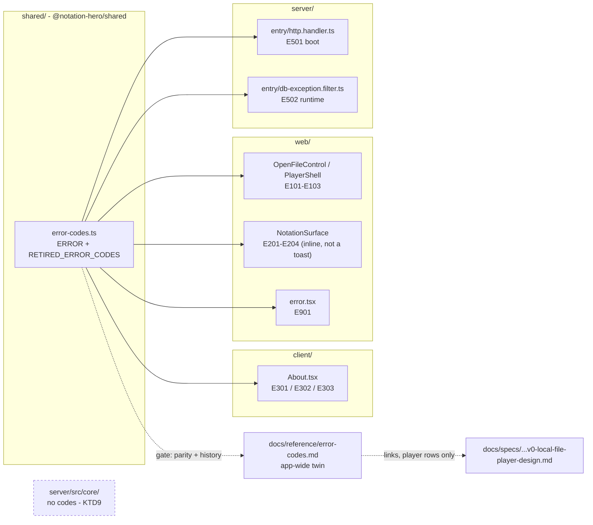
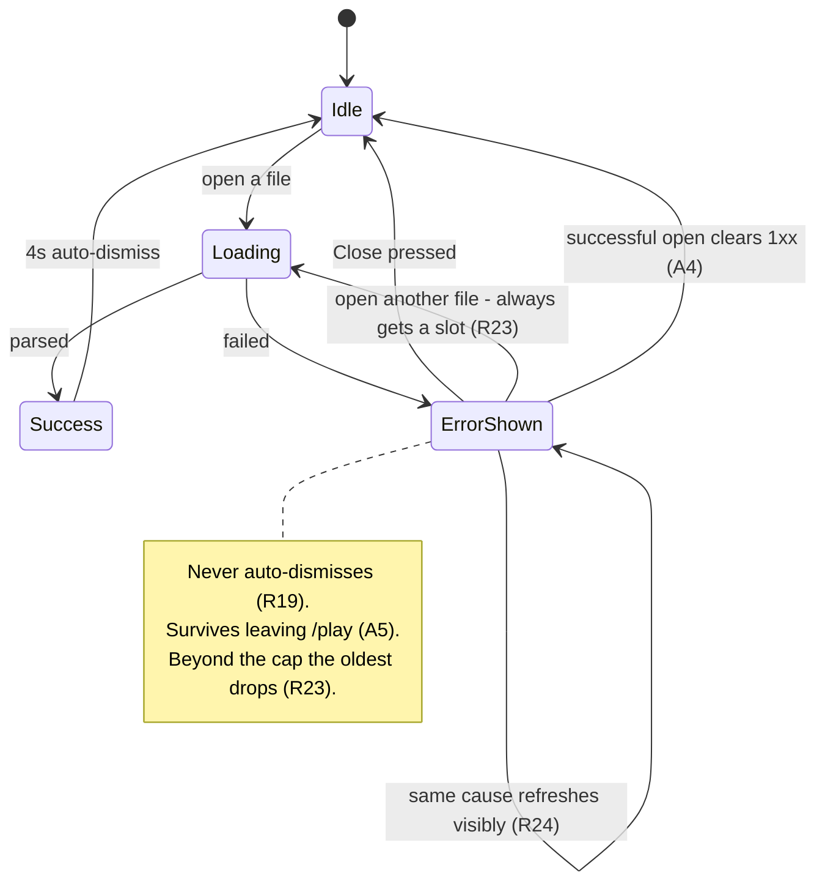

# App-wide error codes, a drift gate, and persistent error toasts - Plan

Jira: [NH-331](https://leocaseiro.atlassian.net/browse/NH-331). Also closes
[NH-311](https://leocaseiro.atlassian.net/browse/NH-311). Overlaps
[NH-257](https://leocaseiro.atlassian.net/browse/NH-257) - see R11 and U6's NH-257 note.

---

## Goal Capsule

**Objective.** Every failure on the surfaces this change audits - the player, the catalog page, and
both server 503s - carries a number a person or an operator can quote. That number is unique across
the whole app, and CI fails when the registry and its documented twin drift apart. Error toasts stay
on screen until dismissed. Surfaces this change does not reach are listed under Deferred to
Follow-Up Work; the Objective does not claim them.

**Authority hierarchy.** The labeled Key Technical Decisions below are settled - implement them, do
not re-open them. Where this plan and `AGENTS.md` disagree on repo mechanics, `AGENTS.md` wins.
Assumptions are weaker than Requirements: they are defaults chosen for the implementer, and a
rendered or measured result that contradicts one is grounds to revisit it, not to work around it.

**Stop conditions.** Stop and report rather than working around:

- U1 fails - the shared package cannot be imported by `server/`. This parks only the units that
  import the registry (U3-U8, U10-U13). **U9 is unaffected and may proceed.**
- Any change would require widening the `core-purity` allow-list (see KTD9).
- U9's measured check finds no toaster position that satisfies R20 at all three widths.

**Execution profile.** Phase 1 (U1-U8) closes the coding gaps and lands the gate. Phase 2 (U9-U13)
changes user-visible layout. Phase 1 is **not** "low risk": U7 adds a fail-closed gate that will
block every future pull request, and U5 adds new runtime failure classification. Phase 2's risk is
layout, which no test can catch - it needs looking at.

**Tail ownership.** The caller owns commit, push, PR and CI.

---

## Product Contract

### Summary

`web/lib/player-errors.ts` already holds a good convention: a TypeScript `as const` object, codes
`E101`-`E901`, one doc comment each, mirrored by a failure table in the v0 player spec. It is scoped
to the player and lives in `web/`, which `client/` and `server/` cannot import - which is why three
user-facing failures carry no number. This promotes that registry to one app-wide source of truth in
`shared/`, gives it an app-wide documented twin of its own, closes the three gaps, and puts a CI gate
behind the pairing that today is only a polite code comment. It also makes error toasts persistent,
stacked, and dismissible.

### Problem Frame

A person hits a failure and wants to report it. On `/play` they can quote `(Error E103)`. On
`/about` they get "Could not reach the API right now." with nothing to quote, and a 503 from the API
is a bare string naming neither its cause nor its origin. The registry that solves this exists but
cannot be reached from two of the three packages that need it. Separately, an error toast disappears
after four seconds - long enough to notice, too short to write down.

### Requirements

#### The registry

- R1. One error-code registry exists at `shared/src/error-codes.ts`, exported from
  `@notation-hero/shared`, as a TypeScript `as const` object with a doc comment per code.
- R2. Every code is unique across the whole app, and a number is never reused for a second meaning -
  including after the code that used it is removed.
- R3. Areas are separated by reserved number range inside that one file, not by separate files:
  `1xx` opening a file, `2xx` engine and assets, `3xx` catalog and API, `5xx` server and
  infrastructure, `9xx` unexpected crash.
- R4. Existing codes `E101`-`E104`, `E201`-`E204` and `E901` move across with their values and
  meanings unchanged, and their rendered message strings do not change.
- R5. `E104` stays defined and unused. The v0 spec records it as "Unused in v0a"; it is reserved.
- R6. The registry names retired codes explicitly, and the gate proves R2 against history rather
  than against the current file alone - a number allocated in the past can never reappear with a new
  meaning, even if a single commit removes it from every file.
- R7. `client/`, `web/` and `server/` can each import the registry.

#### The documented twin

- R8. An app-wide reference page at `docs/reference/error-codes.md` lists every code with its
  meaning, and is the file the gate checks against the registry. Its scope matches the registry's.
- R9. The v0 player spec keeps its own failure-states table for the player's `1xx`, `2xx` and `9xx`
  rows, with its Behavior column intact, and points at the reference page for the full list. Nothing
  outside the player's scope is added to it, so its Non-goals stay true and it can be archived later
  without breaking the gate.
- R10. A retired code keeps its row on the reference page, marked retired, so parity holds.

#### Closing the audit gaps

- R11. `client/src/components/About.tsx` distinguishes its three failure causes and shows a code for
  each: a non-ok HTTP response, an eight-second timeout, and an unreachable network.
- R12. `server/src/entry/http.handler.ts` returns a code for a boot failure, and
  `server/src/entry/db-exception.filter.ts` returns a different code for a post-boot runtime or
  database failure. These are two distinct producers of a byte-identical 503 body today.
- R13. Both server codes travel in the JSON response body as a `code` field **and** appear in that
  path's existing `console.error` line, so an operator reading CloudWatch can quote the number
  without the client having to surface it.

#### The gate

- R14. `tooling/check-error-codes.mjs` fails when a code is duplicated, when a previously allocated
  number is reused, or when the registry and the reference page do not list the same codes.
- R15. The gate runs on a pull request that edits only the reference page, and on one that edits only
  the registry.
- R16. The gate blocks merge.
- R17. A new canonical item in `.github/pull_request_template.md` claims the work.
- R18. `.claude/agents/pr-checklist-auditor.md` gains a matching category, so the tick is verified
  against the diff rather than counted.

#### Error toasts

- R19. An error toast does not dismiss itself. Success and loading toasts keep their four-second
  auto-dismiss.
- R20. Error toasts from different causes appear together - up to the cap R23 sets - rather than
  replacing one another, and each is readable without a pointer or hover.
- R21. An error toast can be dismissed by pointer and by keyboard, through a control with an
  accessible name and a hit area of at least 44 by 44 pixels, reachable without tabbing through the
  whole page.
- R22. A persistent toast never makes any player control unreachable - the transport row, the
  header's tempo steppers, and the header's third grid cell reserved for Settings included.
- R23. No toast is focusable while invisible. A cap on simultaneous error toasts enforces this, and
  the cap is whatever number still satisfies R22 at 320 px, 700 px and 1280 px, measured rather than
  guessed. The loading and success toast never counts against that cap.
- R24. A repeated identical failure refreshes its existing toast rather than adding a second, and the
  refresh is visible - a person who retries can tell the retry registered.
- R25. A failed open is announced to assistive technology with its code, the way a successful open
  already is.

#### Governance

- R26. `docs/decisions/decision-registry.md` and `docs/decisions/decision-changelog.md` record this
  decision in the same pull request, per the repo's decision-governance rule.

### Acceptance Examples

- AE1. Covers R11. The API is down. You open `/about`, wait, and read "The catalog is taking too long
  to answer. (Error E302)" - E302 rather than E303 because the request timed out instead of failing
  to reach the network.
- AE2. Covers R19, R20, R21. You drop a 40 MB file, then a corrupt one. Two toasts are on screen,
  both readable without hovering, each with its own Close button. Neither has vanished. You press the
  toast hotkey, land in the toast region, Tab once, press Enter, and one goes away.
- AE3. Covers R14, R15. You add `E305` to the registry and nothing else. CI fails, naming the
  reference page. You add the row; CI passes.
- AE4. Covers R2, R6, R10. You remove `E302` from the registry and from the reference page in one
  commit. CI fails, because the union of live and retired codes shrank against the merge base. You
  add `E302` to `RETIRED_ERROR_CODES` and mark its reference row retired; CI passes. You then try to
  reuse `E302` for a new meaning; CI fails again.
- AE5. Covers R22. A persistent error toast is on screen. You press Play, then a tempo stepper. Both
  respond.
- AE6. Covers R23. Three error toasts are up and you open another file. The "Opening..." toast is
  visible, not parked behind the cap.

### Scope Boundaries

#### Deferred to Follow-Up Work

Each is real and found during this plan's research. None is in this change.

- Splitting `E901` so the app boundary and the player boundary report different numbers, and adding
  `web/app/global-error.tsx` for a throw inside the root layout. R4 pins `E901`'s meaning, so
  splitting it changes a settled decision.
- `client/src/routes/__root.tsx` has no `errorComponent` and no `notFoundComponent`, so a throw or
  an unknown URL in the deployed SPA renders TanStack Router's uncoded defaults.
- `web/app/play/NotationSurface.tsx` reports only the first of several live engine failures.
- Dropping a folder reports the "could not be read" copy, which is wrong for a folder; a multi-file
  drop silently ignores files after the first.
- `web/app/play/PlayerShell.tsx` drops a file pick with no message when the engine failed to load.
- A per-toast Close-button label, so a screen-reader user tabbing a stack can tell the buttons apart.
  Sonner's `closeButtonAriaLabel` is Toaster-level only. Related: NH-306.
- Surfacing the server's `code` in `About.tsx`'s message. The client classifies its own failure under
  R11; reading the server's code is a separate improvement. R13's log half gives the server codes a
  reader in the meantime.
- An affordance for errors beyond the R23 cap (a "2 more" control, or a copy-the-code button), so a
  burst of failures loses nothing. R24's de-duplication narrows how often the cap is reached.
- Both `AGENTS.md` and `.github/pull_request_template.md` say every checklist box must be ticked; the
  gate only enforces **canonical** items, so extra checkboxes pass. A wording fix in both places,
  unrelated to error codes.

#### Not in scope

- Error codes inside `server/src/core/`. See KTD9.
- Retiring `E104`. See R5.
- Changing a rendered message string for the codes R4 names (`E101`-`E104`, `E201`-`E204`, `E901`).
  R11 deliberately does change `About.tsx`'s copy, which R4 does not cover.

### Assumptions

Defaults chosen so work can proceed. Each names what would overturn it.

- A1. The toaster's position is **decided by measurement in U9, not here.** Sonner's default is
  bottom-right, where a persistent toast sits over the transport row and takes pointer events; but
  top-right lands on the header's tempo steppers at 700 px and on the reserved Settings cell at
  1280 px. U9 measures the default first so the premise is falsifiable, then moves to `top-center`
  if any player control is covered. **Overturned if** no position satisfies R22 - then stop and
  report, because R19 and R22 cannot both hold with a 356 px fixed overlay.
- A2. The Toaster gets `expand`, so every toast in a stack is readable without hovering. Sonner's
  default collapsed stack renders all but the newest as blank scaled cards.
- A3. `visibleToasts` is set one higher than the R23 error cap, so the loading and success toast
  always has a slot of its own.
- A4. A successful open dismisses outstanding `1xx` toasts. They describe the same interaction.
- A5. Leaving `/play` clears only the loading and success toasts. **Error toasts stay**: they hold the
  number the person is leaving in order to report, and clearing them would delete it. `2xx`
  failures are not toasts at all - they render inline over the notation area - so they do not
  feature here.
- A6. `closeButton` is set per error toast, never globally. Set globally it would put a close control
  on every success toast and turn the existing a11y hit-area test red immediately.
- A7. `About.tsx` gets three codes rather than one, because its three causes need different fixes
  (origin down, cold Lambda, client offline) and the registry exists so a report can name the case.

### Open Questions

None blocking. Two worth recording, both deferred rather than unresolved:

- Is `client/`'s `/about` still a user-reachable surface? `AGENTS.md` names `web/` on Vercel as the
  product client and `client/` as the design system, and the catalog is paused. R11 codes it either
  way - the code exists and renders if reached - but if `/about` is dormant, U5 is lower value than
  its five test scenarios suggest.
- Should the reference page be generated from the registry instead of hand-maintained, which would
  remove the entire drift class the gate exists to catch? KTD4 settled the enforcement mechanism but
  not derivation. Revisit if the table proves tedious.

---

## Planning Contract

### Key Technical Decisions

- KTD1. One registry, globally unique numbers, areas separated by reserved range inside the one file.
  Governs R1, R2, R3.
  (session-settled: user-directed - chosen over a registry per package or per area: a number must
  never repeat across areas, so one file owns the numbering.)
- KTD2. The registry is a TypeScript `as const` object, not JSON. Governs R1.
  (session-settled: user-approved - chosen over a JSON data file plus a typing wrapper: the gate can
  read a `.ts` module directly, and `as const` keeps the per-code doc comments that JSON cannot
  hold.)
- KTD3. The registry lives in `shared/` (`@notation-hero/shared`). Governs R7.
  (session-settled: user-approved - chosen over leaving it in `web/lib/player-errors.ts`: `client/`
  and `server/` cannot import from `web/`, which is why three failures ended up uncoded.)
- KTD4. Enforcement is a canonical checklist item plus a real CI check script. Governs R14, R16, R17.
  (session-settled: user-approved - chosen over a checklist line alone, and over additionally
  writing a custom ESLint rule: the drift risk is real today and guarded only by a code comment,
  while an ESLint plugin was heavier with false-positive risk.)
- KTD5. Both audit gaps are retrofitted in this change, VR baselines included. Governs R11, R12.
  (session-settled: user-approved - chosen over shipping the gate alone and filing a follow-up: it
  leaves no uncoded user-facing error on `master`.)
- KTD6. Error toasts become persistent, stacked and dismissible in this change, closing NH-311.
  Governs R19, R20, R21.
  (session-settled: user-directed - chosen over doing only the persistence half now and leaving the
  Close button to NH-311 separately: persistent stacked errors are unusable without a way to close
  them.)
- KTD7. The gate runs in the **`lint`** job, not `quality`. Governs R15. `quality` is gated on the
  `code` paths-filter, which covers `shared/**` and `tooling/**` but not `docs/**`. A pull request
  editing only the reference page would skip `quality` and pass green with a drifted table - half of
  what this gate exists to catch. `lint` runs on `code || docs_or_config`, and
  `check:supply-chain-pins` is the existing precedent for a `node tooling/*.mjs` check there.
- KTD8. The gate reads the registry by **repo-relative path** (`../shared/src/error-codes.ts`), never
  by package name. Node 24 strips types natively, but it **refuses to strip types for any file it
  resolves under `node_modules`** - probed on the repo's own v24.16.0, which throws
  `ERR_UNSUPPORTED_NODE_MODULES_TYPE_STRIPPING`. A package-name import happens to work in this
  worktree only because pnpm symlinks workspace packages and Node resolves them to their real paths; a hoisted
  install or a `pnpm deploy` breaks it. The relative path sidesteps the restriction entirely, and
  needs no loader and no build step.
- KTD9. Whether `server/src/core/` may carry codes is left open, not decided.
  (session-settled: user-approved - chosen over building the outer-ring translation layer now, and
  over widening the fail-closed `core-purity` allow-list: `core/` holds one string helper and no
  business rules, so either choice designs for code that does not exist.)
- KTD10. `server/`'s import of the registry is proved before the design rests on it (U1). `server/`
  is the only package on `nodenext` while every other is on `bundler`, and its Lambda build is
  two-stage (`nest build` via SWC, then esbuild). Research probed the three server legs and all pass
  today, so U1 is expected to confirm rather than discover - but Turbopack's handling of a `.ts`
  `exports` target under `transpilePackages`, and each vitest lane's resolution of the linked
  package, remain unproven until U1 runs.
- KTD11. Error-toast persistence is asserted in a unit test, not left to the visual and accessibility
  lanes. Every existing Sonner story already passes `duration: Infinity`, so the **`duration`** half
  of the wrapper is invisible to both by construction. The **`closeButton`** half is not: the
  `ErrorToast` story imports `toast` from `./Sonner`, so it inherits the close button and its two
  baselines change.
- KTD12. The live-error-toast bookkeeping that R20, R23 and R24 need lives in one place -
  `client/src/components/ui/Sonner/Sonner.tsx`, beside the wrapped `toast.error` that mints the ids.
  Splitting it across `web/` call sites cannot work: `web/` cannot enumerate outstanding ids, because
  the file-name half of each id is unknowable after the fact.

### High-Level Technical Design

Where a code is attached, and what the gate compares:



The toast lifecycle after Phase 2, which is where the behavior risk concentrates:



### Implementation Constraints

Each was verified against the live repo during planning.

- `shared/` is not yet a real package: no `test` script, no `lint` script, no ESLint config, no
  vitest. Root `test` is `pnpm -r --if-present run test`, so a co-located test there would silently
  never run and exit 0. U2 fixes this, before the registry.
- `shared/tsconfig.json` is `include: ["src/**/*.ts"]`, which excludes a new `shared/vitest.config.ts`.
  An ESLint config mirroring `server/`'s brings `projectService: true`, which then fails with a
  parser error on that file. `client/tsconfig.json` shows the pattern - it names `vite.config.ts`.
- Root `fix` hard-codes three packages, and `lefthook.yml` has exactly three rooted eslint hooks.
  A fourth package must be added to both or `pnpm run fix` skips it forever.
- `web/next.config.ts` lists `transpilePackages: ['@notation-hero/client']` only.
- The only workspace dependency today is `web` depending on `client`. `.syncpackrc.json` imposes
  nothing, and no tsconfig anywhere uses `references`.
- `canonicalItems()` in `tooling/pr-checklist-lib.mjs` runs on the raw template and does **not**
  strip HTML comments or code fences. An example `- [ ]` line in a comment would become a required
  item. Do not put one there.
- `tooling/*.mjs` is not linted by ESLint (no root flat config), but Prettier, cspell, markdownlint
  and editorconfig-checker all apply. `knip` is not a CI gate.
- A gate is only a gate when its job is named in `ci-green`'s `needs:` array;
  `tooling/workflow-guards.test.mjs` is the template for asserting that wiring.
- `expectHitAreas` in `web/e2e/a11y.e2e.ts` measures each matched `button`'s own
  `getBoundingClientRect()`. A `::after` overlay leaves the measured box at 20 px and still fails; the
  element itself has to grow.
- `Sonner.vr.ts` runs the `focus` state **only** for the `with-action` story, which fires a neutral
  `toast(...)`. Under A6 that story never gains a close button, so `focusTabs: 2` /
  `focusExpect: '[data-action]'` keep matching and must be left alone. `runVrStories` has no
  per-story focus override today.
- Both 503 bodies are pinned by whole-body deep equality -
  `toHaveBeenCalledWith({ message: 'Service unavailable' })` at `db-exception.filter.spec.ts:27` and
  `toEqual({ message: 'Service unavailable' })` at `http.handler.spec.ts:102`.
- Kill any Storybook on port 6006 before regenerating VR baselines; `reuseExistingServer` is on
  outside CI and a stale server produces desynced baselines.
- Merging `master` joins changelog entries with no blank line, because `merge=union` is scoped to the
  changelog. Run `pnpm run lint:md` after any such merge.
- A local `cspell` run currently fails with a missing `smol-toml` dependency, unrelated to this work.
  Repair the install before trusting `check:all` locally.

### Sequencing

U1 gates U3-U8 and U10-U13. U2 gates U3. **U9 depends on nothing** and may proceed even if U1 stops.
Phase 1 (U1-U8) is green on its own, because U7 lands the gate and the reference page together.

---

## Implementation Units

### Unit Index

| U-ID | Title                                                      | Key files                                                        | Depends on |
| ---- | ---------------------------------------------------------- | ---------------------------------------------------------------- | ---------- |
| U1   | Prove `@notation-hero/shared` resolves in every build path | `shared/`, `client/`, `web/`, `server/`                          | -          |
| U2   | Make `shared/` a real package (test, lint, fix, hooks)     | `shared/package.json`, `shared/tsconfig.json`, `lefthook.yml`    | U1         |
| U3   | The registry                                               | `shared/src/error-codes.ts`                                      | U2         |
| U4   | Re-point `web/` at the registry                            | `web/lib/player-errors.ts` (deleted), `web/app/**`               | U3         |
| U5   | Code the catalog failures                                  | `client/src/components/About.tsx`                                | U3         |
| U6   | Code both server 503s, body and log                        | `server/src/entry/*.ts` + both specs                             | U3         |
| U7   | The reference page and the drift gate                      | `docs/reference/error-codes.md`, `tooling/check-error-codes.mjs` | U3         |
| U8   | Checklist item and auditor category                        | `.github/pull_request_template.md`, `.claude/agents/`            | U7         |
| U9   | Toast behavior and the error-toast registry                | `client/src/components/ui/Sonner/Sonner.tsx`                     | -          |
| U10  | Toast call sites and the shared id                         | `web/app/play/*.tsx`                                             | U9         |
| U11  | Fix the loading-paint and settle helpers                   | `web/app/play/PlayerShell.tsx`, `web/e2e/a11y.e2e.ts`            | U10        |
| U12  | New a11y, VR and e2e coverage                              | `client/src/vr-helpers.ts`, Sonner test files, `web/e2e/*`       | U11        |
| U13  | Docs, spec link and decision registry                      | `docs/specs/`, `docs/decisions/`, `AGENTS.md`                    | U7, U10    |

### U1. Prove `@notation-hero/shared` resolves in every build path

**Goal.** Establish, before any design rests on it, that all three packages can import the shared
package - especially `server/`, the only one on `nodenext` - and that a root `.mjs` script can read
the registry file.

**Requirements.** R7.

**Dependencies.** None.

**Files.** `shared/package.json`, `client/package.json`, `web/package.json`, `server/package.json`,
`web/next.config.ts`.

**Approach.**

1. Add `"@notation-hero/shared": "workspace:*"` to `dependencies` in `client/`, `web/` and
   `server/`, then `pnpm install`.
2. Add `'@notation-hero/shared'` to `transpilePackages` in `web/next.config.ts`.
3. Import the existing `SHARED_API_VERSION` once in each package - `shared/src/index.ts` is not
   edited. **Also** add a temporary export shaped like the real registry (an `as const` object plus a
   derived union type plus a type-only re-export), because a plain string can resolve where the real
   shape fails under `nodenext` and esbuild.
4. Prove each path: `client build`, `web build` (Turbopack under `transpilePackages` - the least
   certain leg), `server typecheck`, `server build:lambda`, each package's `test` (three different
   vitest resolutions), and a root `node -e` importing `shared/src/error-codes.ts` by relative path
   per KTD8.
5. Remove the three temporary imports and the registry-shaped export.

**Execution note.** De-risking spike. If `server/` cannot resolve it, stop and report - do not work
around it. The fallback is a dual-target `exports`: emit a CJS build plus declarations for `shared/`
and add a `"require"`/`"node"` condition pointing at them, keeping `./src/index.ts` on `default` for
the bundler-based packages. Note that adding a bare `types`/`import` condition is a no-op, because
`exports` is already an unconditional string and no other artifact exists to point at; and that
emitting anything requires overriding `noEmit`, which `tsconfig.base.json` sets globally.

**Verification.** Every command in step 4 passes with an import present. `pnpm run depcheck` and
`pnpm run syncpack` stay green.

**Test scenarios.** `Test expectation: none - a build-path proof that leaves no behavior behind.`
The proof is the commands in Verification.

### U2. Make `shared/` a real package

**Goal.** Give `shared/` `test` and `lint` scripts that actually run, and wire it into the repo's own
fix and hook paths. Without this, U3's tests are a silent no-op.

**Requirements.** R1 (its tests), R7.

**Dependencies.** U1.

**Files.** `shared/package.json`, `shared/tsconfig.json`, `shared/eslint.config.mjs`,
`shared/vitest.config.ts`, root `package.json`, `lefthook.yml`.

**Approach.** Add `vitest` and `"test": "vitest run"`, including `src/**/*.{test,spec}.ts` (the
`client/` form - `server/`'s matches only `*.spec.ts`). Add `"lint": "eslint . --max-warnings 0"` and
a `shared/eslint.config.mjs` extending `eslint.config.base.mjs`, carrying over `server/`'s
`{ files: ['vitest.config.ts'], rules: { 'import/no-default-export': 'off' } }` carve-out. Widen
`shared/tsconfig.json`'s `include` to `["src/**/*.ts", "vitest.config.ts"]` so `projectService` can
resolve the new config file. Append `pnpm --filter @notation-hero/shared exec eslint . --fix` to the
root `fix` script and add an `eslint-shared` pre-commit command beside the existing three.

**Patterns to follow.** `server/package.json` scripts; `server/eslint.config.mjs`;
`client/tsconfig.json`'s `include` naming its own config file.

**Verification.** A deliberately failing placeholder test in `shared/src/` makes root
`pnpm run test` fail; remove it once seen to fail. Root `pnpm run lint` reports on `shared/`, and
`pnpm run fix` reaches it.

**Test scenarios.**

- Root `pnpm run test` runs a test in `shared/src/` - prove by making it fail first.
- Root `pnpm run lint` reports a deliberate lint error in `shared/src/` - prove by making it fail
  first.
- `pnpm run lint` in `shared/` does not fail with a parser error on `vitest.config.ts`.

### U3. The registry

**Goal.** One `as const` registry, ranged, with a retired list, and its own tests.

**Requirements.** R1, R2, R3, R4, R5, R6.

**Dependencies.** U2.

**Files.** `shared/src/error-codes.ts`, `shared/src/error-codes.test.ts`, `shared/src/index.ts`.

**Approach.** Move the nine existing entries across with their values and doc comments intact,
grouped by range with a comment per range. Add `E301` non-ok response, `E302` timed out, `E303`
network unreachable, `E501` boot failure, `E502` runtime or database failure. Export
`RETIRED_ERROR_CODES` (empty for now) and a union type of the live codes. State the pairing rule in
the header, naming `docs/reference/error-codes.md`.

**Technical design** (directional, not a specification):

```ts
/** 1xx opening a file - 2xx engine and assets - 3xx catalog and API
 *  5xx server and infrastructure - 9xx unexpected crash.
 *  A number is never reused. Retiring one means moving it to RETIRED_ERROR_CODES and
 *  marking its row retired in docs/reference/error-codes.md. */
export const ERROR = {
  /** Over the size limit; the file is never read. */
  fileTooLarge: 'E101',
  // ... E102, E103, E104 (reserved, see R5), E201-E204
  /** The catalog API answered, but not with a success status. */
  catalogResponseNotOk: 'E301',
  /** The catalog request passed its eight-second deadline. */
  catalogTimedOut: 'E302',
  /** The catalog request never reached the network. */
  catalogUnreachable: 'E303',
  /** The API failed to start. */
  serverBootFailed: 'E501',
  /** The API was running and the request failed. */
  serverRequestFailed: 'E502',
  /** A render crash caught by an error boundary. */
  unexpectedCrash: 'E901',
} as const;

export const RETIRED_ERROR_CODES = [] as const;
export type ErrorCode = (typeof ERROR)[keyof typeof ERROR];
```

**Patterns to follow.** `web/lib/player-errors.ts` - its shape is what is being promoted.

**Verification.** `pnpm --filter @notation-hero/shared run test` and `typecheck` pass.

**Test scenarios.**

- Every value in `ERROR` matches `/^E\d{3}$/`.
- No value appears twice in `ERROR`.
- No value in `ERROR` also appears in `RETIRED_ERROR_CODES`.
- The nine pre-existing codes hold their exact historical values (`fileTooLarge` is `E101`,
  `unexpectedCrash` is `E901`, and so on) - R4's guard against an accidental renumber.
- Every code sits in a declared range: no `4xx`, `6xx`, `7xx` or `8xx` value exists.

### U4. Re-point `web/` at the registry

**Goal.** `web/` imports from `@notation-hero/shared`; `web/lib/player-errors.ts` is gone. No rendered
string changes.

**Requirements.** R4, R7.

**Dependencies.** U3.

**Files.** `web/lib/player-errors.ts` (deleted), `web/app/play/OpenFileControl.tsx`,
`web/app/play/PlayerShell.tsx`, `web/app/play/NotationSurface.tsx`, `web/app/error.tsx`,
`web/app/play/error.tsx`.

**Approach.** Replace each `player-errors` import with the shared one and rename the references.
Delete the old file. Keep every message string byte-identical.

**Verification.** `web` `typecheck`, `test`, `build` pass. The six `web/e2e/player.e2e.ts` assertions
pinning `(Error E101)`, `(Error E103)`, `Error E203` and `Error E204` pass unchanged - they are R4's
contract test.

**Test scenarios.**

- Existing `web/` unit tests pass with no edits.
- `rg "player-errors" web/` returns nothing.

### U5. Code the catalog failures

**Goal.** `About.tsx` tells its three causes apart and names a code for each.

**Requirements.** R11.

**Dependencies.** U3.

**Files.** `client/src/components/About.tsx`, `client/src/components/About.test.tsx`.

**Approach.** In `fetchCatalog`, throw a typed failure carrying the right code: the abort from the
eight-second timer maps to `E302`, `!res.ok` maps to `E301` (append `res.status`, the integer - never
`res.statusText`, which is origin-supplied), anything else maps to `E303`. In the `isError` branch,
read the code off the error and render it. `retry: 1` in `client/src/main.tsx` means a hard-down API
shows loading for roughly seventeen seconds first, so the `E302` copy says the request timed out
rather than implying an instant failure - per AE1.

**Patterns to follow.** `readFailureMessage` in `web/app/play/OpenFileControl.tsx` - a pure function
mapping a cause to copy plus a code.

**Verification.** `client` `test` and `typecheck` pass.

**Test scenarios.**

- A 503 response renders a message containing `E301` and the status number.
- An aborted request from the eight-second timer renders `E302` with timeout copy.
- A rejected `fetch` (network `TypeError`) renders `E303`.
- The success path renders the catalog and no code.
- An abort caused by unmount, not by the timer, renders no error at all.

### U6. Code both server 503s, body and log

**Goal.** The two distinct producers of `{ message: 'Service unavailable' }` become distinguishable,
in the response and in CloudWatch.

**Requirements.** R12, R13.

**Dependencies.** U3.

**Files.** `server/src/entry/http.handler.ts`, `server/src/entry/http.handler.spec.ts`,
`server/src/entry/db-exception.filter.ts`, `server/src/entry/db-exception.filter.spec.ts`.

**Approach.** Add `code: ERROR.serverBootFailed` to the bootstrap-failure body and
`code: ERROR.serverRequestFailed` to the catch-all body. Add the same code to each path's existing
`console.error` prefix (`'[http.handler] E501 bootstrap failed:'`,
`'[api] E502 unhandled error:'`) so R13's operator half holds without the client work. Leave the
`HttpException` passthrough untouched. Neither file is under `server/src/core/`, so the `core-purity`
fence is not involved.

**Approach note - keep the redaction fence intact.** Both bodies are asserted by **whole-body deep
equality**, and that exact-match is the only machine-checked guard stopping a later change from
adding the caught error text - which carries the Neon connection string - to a body that reaches
unauthenticated callers. Update both assertions to the new exact bodies
(`{ message: 'Service unavailable', code: 'E501' }` and `{ ..., code: 'E502' }`). **Do not** relax
either to `expect.objectContaining`.

**Approach note on NH-257.** NH-257 normalizes this same body to `{ message, statusCode }`. Adding
`code` is compatible and does not complete that ticket. Say so in the pull request and on NH-257.

**Verification.** `server` `test`, `typecheck`, `build:lambda` pass. `pnpm run depcheck` stays green.

**Test scenarios.**

- `DbExceptionFilter` maps a non-HTTP exception to a 503 body carrying `E502`, asserted by whole-body
  equality.
- A boot failure returns a 503 body carrying `E501`, asserted by whole-body equality.
- `DbExceptionFilter` passes an `HttpException` through with its own status and body, no code added.
- Neither 503 body contains the original error message or a connection string.
- Each path's `console.error` line carries its code.

### U7. The reference page and the drift gate

**Goal.** An app-wide documented twin, and a gate that fails on duplication, on reuse of a
previously allocated number, and on drift - including on a docs-only edit.

**Requirements.** R8, R10, R14, R15, R16.

**Dependencies.** U3.

**Files.** `docs/reference/error-codes.md`, `tooling/check-error-codes.mjs`,
`tooling/check-error-codes.test.mjs`, `package.json`, `.github/workflows/ci.yml`, `lefthook.yml`,
`tooling/workflow-guards.test.mjs`.

**Approach.**

1. Write `docs/reference/error-codes.md`: one table of every code, its meaning, and the surface that
   raises it, plus a retired section. This is the gate's twin, and it ships in the **same unit** as
   the gate so Phase 1 is green on its own.
2. Write the gate. Export pure functions; guard the CLI half behind
   `import.meta.url === pathToFileURL(process.argv[1]).href`. Import the registry by repo-relative
   path per KTD8. Hold the twin's path in a single exported constant at the top of the script, so
   moving the file is a one-line repoint.
3. History check for R6: read the merge base with
   `git show "$(git merge-base HEAD origin/master)":shared/src/error-codes.ts` and fail when any
   previously allocated number is absent from both the live and retired lists. The `lint` job's
   checkout needs enough history for this - set `fetch-depth: 0` on that step.
4. Add `check:error-codes` to root scripts, to the `check:all` chain, to `lefthook.yml` pre-push, and
   as a step in the **`lint`** job (KTD7). Confirm `lint` is already in `ci-green`'s `needs:`.

**Patterns to follow.** `tooling/check-supply-chain-pins.mjs` for the script and its CLI guard;
`tooling/pr-checklist-lib.test.mjs` for the test shape; `tooling/workflow-guards.test.mjs` for
asserting CI wiring with anchored regexes.

**Verification.** `pnpm run check:error-codes` passes on a clean tree and fails on each seeded fault.
`pnpm run test:tooling` passes.

**Test scenarios.**

- A duplicated value fails, naming the duplicated number.
- A value present in both `ERROR` and `RETIRED_ERROR_CODES` fails.
- A code in the registry but missing from the reference page fails, naming the code.
- A code on the reference page but missing from the registry fails - unless it is in
  `RETIRED_ERROR_CODES`, which satisfies parity (R10).
- A code removed from the registry and the page in one commit fails against the merge base.
- A clean tree passes.
- The workflow test asserts the `check:error-codes` step exists in the `lint` job and that `lint`
  appears in `ci-green`'s `needs:`.

### U8. Checklist item and auditor category

**Goal.** Every pull request claims the work, and the tick is verified rather than counted.

**Requirements.** R17, R18.

**Dependencies.** U7.

**Files.** `.github/pull_request_template.md`, `.claude/agents/pr-checklist-auditor.md`.

**Approach.** Append one `- [ ]` line under `## Checklist`, past-tense and conditional so it is
always tickable, in the voice of the existing items - for example: "If this PR added a user-facing or
operator-facing error, I gave it a code in the shared registry and added it to the error-code
reference." Add an `error-codes` row to the auditor's Step 2 classification table beside
`decision-log`: the condition applies when the diff adds a user-facing message, a toast, an HTTP
error body, or an environment guard; it is contradicted when such a path is added with no
`shared/src/error-codes.ts` change.

**Approach note.** `canonicalItems()` does not strip HTML comments, so do not add an example checkbox
inside a comment - it would become a required item.

**Verification.** `pnpm run test:tooling` passes. Run `tooling/pr-checklist.mjs` locally with
`PR_BODY` set, with the new item ticked and unticked, and see it pass then fail.

**Test scenarios.**

- `canonicalItems()` includes the new item.
- The gate fails when the new item is absent from a body, and passes when present and ticked.

### U9. Toast behavior and the error-toast registry

**Goal.** Error toasts persist, stack readably, carry a reachable 44 px Close button, and never
occlude a player control. Success and loading unchanged.

**Requirements.** R19, R20, R21, R22, R23, R24.

**Dependencies.** None - this unit imports nothing from the registry.

**Files.** `client/src/components/ui/Sonner/Sonner.tsx`,
`client/src/components/ui/Sonner/Sonner.test.tsx`.

**Approach.**

1. Replace the bare `toast` re-export with one whose `error` **is** the wrapper, so there is exactly
   one reachable `toast.error`. Preserve sonner's callable-plus-statics shape (`toast()`, `.success`,
   `.loading`, `.dismiss`, `.promise`, `.warning`, `.info`) - `client/src/index.ts` re-exports it as
   the design system's public `toast` and `web/` uses several. Watch `strictTypeChecked`: an
   `Object.assign` re-wrap trips the `no-unsafe-*` rules.
2. The wrapper applies `duration: Infinity` and `closeButton: true` per call (A6 - sonner has no
   per-type option) and mints the id.
3. Own the bookkeeping here (KTD12): a module-level insertion-ordered `Map` keyed by toast id.
   Re-raising an existing id does **not** grow it, which is what makes R24 compatible with R23's cap.
   Prune in each toast's `onDismiss`/`onAutoClose`. Dismiss the first entry only when the map already
   holds cap-many distinct ids. Export `dismissErrors(predicate)` for U10's A4 and A5.
4. Make R24's refresh visible: dismiss then re-raise under the same id, so the enter animation
   re-runs and the live region re-fires. An in-place text update of identical copy shows nothing.
5. Size the close button so it passes the gate **without** defacing the toast: grow the element to
   `size-11` with `bg-transparent! border-0!`, and draw the visible 20 px circle with a centred
   `before:` pseudo-element carrying the background and border. `expectHitAreas` measures the
   element's own box, so an overlay cannot work; growing it naively paints an opaque disc over the
   toast's icon and title. Replace sonner's hardcoded `0 0 0 2px rgba(0,0,0,.2)` focus ring with the
   token ring - the existing `actionButton` entry is the precedent for beating sonner's specificity.
6. Set `expand` (A2). Set `visibleToasts` to the R23 cap plus one (A3).
7. Set sonner's `hotkey` explicitly and document it, so R21's "reachable without tabbing through the
   whole page" holds - the Toaster is the last node in the root layout.
8. Do not touch `loading: 'transition-none!'`. It is load-bearing for an e2e test and a measured bug.

**Execution note - measure before choosing a position.** R22 and the cap in R23 are layout facts, and
no test can see occlusion. Run the app, raise three persistent errors, and at 320 px, 700 px and
1280 px record what is covered - **starting from sonner's current bottom-right default**, so A1's
premise is actually falsifiable. If any player control is covered, move to `top-center`, not
top-right: top-right lands on the header's tempo steppers at 700 px and on the reserved Settings cell
at 1280 px. Note that below 600 px sonner switches to mobile CSS and the close button sits about
0.6 px from the left viewport edge - one rounding from tripping `expectHitAreas`'s containment check.
Record the chosen position, the measured cap, and both readings in the pull request.

**Patterns to follow.** The `actionButton` entry in `Sonner.tsx` for specificity; NH-304's
`aria-disabled` pattern if the button ever gains a disabled state.

**Verification.** `client` `test`, `lint`, `typecheck` pass, and the measurement above is done and
recorded.

**Test scenarios.**

- `toast.error` is still present after five seconds of fake timers, while `toast.success` is gone -
  KTD11 makes this the only guard on persistence.
- A `toast.error` raised through the package's **public** `toast` export is also still present after
  five seconds, so the unwrapped path cannot reappear.
- Two `toast.error` calls with different content produce two toast nodes.
- The same content twice produces one node, and that node is replaced rather than updated in place.
- The error toast renders a close control with an accessible name; pressing it removes that toast and
  leaves the other.
- `toast.success` and `toast.loading` render no close control and keep their default duration.
- Raising cap-plus-one errors leaves exactly cap-many, and a loading toast raised alongside them is
  not one of the dropped.
- `dismissErrors` removes only the toasts its predicate matches.

Use `fireEvent`, not `userEvent` - jsdom does not implement `setPointerCapture`, which sonner's
pointerdown path needs.

### U10. Toast call sites and the shared id

**Goal.** Errors stack without stranding the loading spinner, and the failure path announces itself.

**Requirements.** R19, R20, R24, R25.

**Dependencies.** U9.

**Files.** `web/app/play/OpenFileControl.tsx`, `web/app/play/PlayerShell.tsx`.

**Approach.** The three error branches (`OpenFileControl.tsx:73`, `PlayerShell.tsx:443`,
`PlayerShell.tsx:494`) pass `id: 'notation-load'`, which forces replacement. Replace each with an
explicit `toast.dismiss('notation-load')` followed by the error raised under
`` `${code}:${file.name}` `` - that keeps the spinner from being stranded (why the shared id existed)
and lets different causes stack. Leave the loading and success calls on `id: 'notation-load'`. Use
`dismissErrors` from U9 for A4 (a successful open clears `1xx`) and A5 (leaving `/play` clears only
loading and success - errors stay). For R25, write the failure message and its code into
`PlayerShell`'s existing `aria-live="polite"` region, mirroring the success path's
`setAnnouncement('Opened …')`.

**Verification.** `web` `test` and `typecheck` pass.

**Test scenarios.**

- A failed open leaves no "Opening..." toast on screen.
- Two different failure causes produce two toasts.
- The same file failing twice produces one toast, visibly re-raised.
- A successful open after a failed one leaves no `1xx` error toast behind.
- Navigating from `/play` to `/` leaves a standing error toast in place.
- After a failed open the live region carries the failure message and its code.

### U11. Fix the loading-paint and settle helpers

**Goal.** Repair the two test-infrastructure helpers that stacking breaks.

**Requirements.** R19, R20 (their guards).

**Dependencies.** U10.

**Files.** `web/app/play/PlayerShell.tsx`, `web/e2e/a11y.e2e.ts`.

**Approach.**

1. `loadingToastPainted()` waits on `document.querySelector('[data-sonner-toast][data-mounted="true"]')`
   - **any** mounted toast. With a persistent error already up it returns on frame one and the
     synchronous parse takes the main thread before the new loading toast paints - exactly the bug the
     helper was written for. Scope the wait to the loading toast's own node.
2. `settleToasts()` polls only `.first()` and only to opacity `'1'`. New toasts are prepended, so
   `.first()` is the newest while the ones behind are mid-transition - and a background or removed
   toast rests at `0` and never reaches `'1'`, which times out. Settle the whole list, accepting
   either stable value, and skip nodes marked removed or not visible.

**Execution note.** Write the regression test for (1) first and watch it fail. It is invisible to
every existing test, because `web/e2e/player.e2e.ts` only exercises a clean page.

**Verification.** `web` `test:e2e` passes, including the new case.

**Test scenarios.**

- Raise a persistent error, then open a large file under a 20x CPU throttle: the "Opening..." toast
  reaches a painted opacity above 0.9. Confirm this fails before the fix.
- `settleToasts` returns rather than timing out when a removed toast is mid-unmount.
- `settleToasts` waits for a background toast that is still fading.

### U12. New a11y, VR and e2e coverage

**Goal.** The new resting states are audited, and the visual baselines match.

**Requirements.** R21, R22, R23.

**Dependencies.** U11.

**Files.** `client/src/vr-helpers.ts`, `client/src/components/ui/Sonner/Sonner.story-ids.ts`,
`client/src/components/ui/Sonner/Sonner.stories.tsx`,
`client/src/components/ui/Sonner/Sonner.vr.ts`,
`client/src/components/ui/Sonner/Sonner.vr.ts-snapshots/`, `web/e2e/a11y.e2e.ts`.

**Approach.** Add stories for a single persistent error, a readable stack at the cap, and the
cap-plus-one case; add their ids to `SONNER_STORY_IDS` so VR and axe pick them up. Extend
`captureSelectorsForStory` to include the new stack ids, or the clip falls back to the front toast
only. Add a `/play` a11y case with a persistent error on screen.

**Approach note - leave the existing focus assertion alone.** `Sonner.vr.ts` runs the `focus` state
only for `with-action`, which fires a neutral `toast(...)` and under A6 never gains a close button,
so `focusTabs: 2` / `focusExpect: '[data-action]'` keep matching. Re-tuning them would break a
passing assertion. To pixel-guard the close button's focus ring instead, add per-story
`focusTabsForStory` / `focusExpectForStory` overrides to `client/src/vr-helpers.ts` beside the
existing `statesForStory`, and give the new persistent-error story `['resting','focus']` with
`focusExpect` `'[data-close-button]'`.

**Approach note - baselines that change.** Per KTD11 the close button invalidates
`sonner-error-toast-light-resting-chromium-linux.png` and its dark twin, because the `ErrorToast`
story imports `toast` from `./Sonner` and inherits the wrapper. `Sonner.tint.vr.ts` is a second
suite in the same folder whose error-tint assertions also touch the error toast - check it.
Regenerate with `pnpm run test:vr:docker:update` from the repo root after killing any Storybook on
port 6006. Baselines are Linux-only; never regenerate from a local macOS run.

**Verification.** `client` `test:a11y` and the VR project pass; the `web/e2e` a11y lane passes. Every
regenerated PNG in the diff is explainable.

**Test scenarios.**

- axe reports no violations with one persistent error at rest, in light and dark.
- The close button passes the 44 px hit-area gate. Confirm it fails before the sizing fix.
- The visible close circle does not cover the toast's icon or title.
- At cap-plus-one errors, no element is focusable while invisible.
- The stack story captures the whole toaster, not just the front toast.

### U13. Docs, spec link and decision registry

**Goal.** The documentation matches what now exists, and the v0 spec stays inside its own scope.

**Requirements.** R9, R26.

**Dependencies.** U7, U10.

**Files.** `docs/specs/2026-09-10-v0-local-file-player-design.md`,
`docs/decisions/decision-registry.md`, `docs/decisions/decision-changelog.md`, `AGENTS.md`.

**Approach.** In the v0 spec, keep the failure-states table's player rows (`1xx`, `2xx`, `9xx`) with
their Behavior column, and rewrite the closing paragraph to point at
`docs/reference/error-codes.md` instead of `web/lib/player-errors.ts`. **Add no `3xx` or `5xx` rows:**
the spec's Non-goals say "No authentication, no backend, no database" and "No catalog", and adding
those rows would contradict a locked section. Add a changelog entry dated 2026-09-26 in the
established `### YYYY-MM-DD - title (NH-331)` shape, recording the one-registry decision, the
TypeScript-over-JSON rationale, and the deliberately-left-open `core/` question. Update the
**decision-registry** entry that describes the old `web/lib/player-errors.ts` pairing. In
`AGENTS.md`, add the new gate to the root-checks list and one line stating that moving or archiving
the reference page requires repointing the gate's path constant in the same pull request.

**Verification.** `pnpm run lint:md` and `pnpm run lint:spell` pass.
`pnpm run check:error-codes` passes.

**Test scenarios.** `Test expectation: none - documentation. U7's gate is what proves the reference
page agrees with the registry, and it runs in CI.`

---

## Verification Contract

Run from the repo root unless stated.

| Gate                | Command                                                         |
| ------------------- | --------------------------------------------------------------- |
| Everything CI runs  | `pnpm run check:all`                                            |
| Lint and format     | `pnpm run lint && pnpm run typecheck`                           |
| Unit tests          | `pnpm run test`                                                 |
| Tooling tests       | `pnpm run test:tooling`                                         |
| Hexagon fence       | `pnpm run depcheck` && `pnpm run check:core-purity`             |
| Layout guard        | `pnpm run check:layout`                                         |
| Dependency versions | `pnpm run syncpack`                                             |
| The new gate        | `pnpm run check:error-codes`                                    |
| Design-system CSS   | part of `pnpm --filter @notation-hero/web run build`            |
| a11y                | `pnpm --filter @notation-hero/client run test:a11y`             |
| VR check (Linux)    | `pnpm run test:vr:docker`                                       |
| VR regenerate       | `pnpm run test:vr:docker:update`, then review every changed PNG |
| e2e                 | `pnpm --filter @notation-hero/web run test:e2e`                 |

Never pass `--no-verify`. Never chain targets as `pnpm -r lint typecheck`.

**Local green is not CI green.** Binary versions and scan scope differ. Watch the actual `ci.yml` run
to completion rather than trusting an early `gh pr checks` exit. `check:all` only covers
`check:error-codes` once U7's root-script edit lands.

---

## Definition of Done

**Global.**

- Every requirement R1-R26 is met or explicitly deferred in Scope Boundaries.
- Every command in the Verification Contract passes.
- The U9 measurement was **done in a running browser** at 320 px, 700 px and 1280 px, starting from
  sonner's bottom-right default; the chosen position, the measured error cap, and what was covered in
  each position are recorded in the pull request (R22, R23, A1).
- The three tests that must fail first were seen to fail first: the loading-paint case in U11, the
  44 px close-button case in U12, and the placeholder lint/test proofs in U2.
- Neither 503-body assertion was loosened from whole-body deep equality.
- `docs/decisions/` carries this change in the same pull request (R26).
- The pull request body explains why the change is large, and records the NH-257 overlap.
- No dead-end code from an abandoned approach remains. In particular U1's three temporary imports and
  its registry-shaped export are gone.

**Per unit.** Each unit's Verification block passes and its test scenarios exist as real tests.

**Not done if.** `shared/src/` has a test that does not actually run; the drift gate lives in the
`quality` job; the gate imports the registry by package name; `3xx` or `5xx` rows were added to the
v0 player spec; any rendered message string for an R4 code changed; `web/lib/player-errors.ts` still
exists; or `Sonner.vr.ts`'s suite-level `focusTabs` / `focusExpect` were re-tuned.
