# Skill routing — which skill to run, and when

Decision flowchart for picking between the three skill families
(compound-engineering `ce-*`, superpowers, gstack) plus built-ins.
Edit the Mermaid source below directly — GitHub renders it natively;
for visual tweaking paste it into <https://mermaid.live>.

Legend: 🟣 purple = compound-engineering (ce-) · 🟢 teal = superpowers ·
🟠 coral = gstack (gs) · ⚪ gray = built-in Claude Code.

Golden rule: **don't cross the streams** — `ce-brainstorm` feeds `ce-plan`;
`superpowers:brainstorming` feeds `writing-plans`. gstack authors nothing at
the plan stage; it reviews/ships whatever the other two produced, so it
composes with both.

```mermaid
flowchart TD
  classDef ce fill:#EEEDFE,stroke:#534AB7,color:#26215C
  classDef sp fill:#E1F5EE,stroke:#0F6E56,color:#04342C
  classDef gs fill:#FAECE7,stroke:#993C1D,color:#4A1B0C
  classDef bi fill:#F1EFE8,stroke:#5F5E5A,color:#2C2C2A

  START(["new task arrives"]) --> QBUG{"is something broken?"}

  QBUG -->|yes| DEBUG["/ce-debug — root cause first<br/><i>alts: /investigate gs · superpowers:systematic-debugging</i>"]:::ce
  QBUG -->|no| QWHAT{"do I know WHAT to build?"}

  QWHAT -->|"no idea yet — surprise me"| IDEATE["/ce-ideate<br/>ranked idea candidates"]:::ce
  QWHAT -->|"product direction unclear"| STRAT["/ce-strategy<br/>writes STRATEGY.md"]:::ce
  QWHAT -->|"vague idea in hand"| QSHAPE{"which artifact do I want?"}
  QWHAT -->|"WHAT is crystal clear"| QHOW{"do I know HOW — the approach?"}

  STRAT --> IDEATE
  IDEATE --> QSHAPE

  QSHAPE -->|"product requirements, right-sized ceremony"| BRAIN["/ce-brainstorm<br/>docs/brainstorms/*-requirements.md"]:::ce
  QSHAPE -->|"design spec + hard no-code gate"| SPBRAIN["superpowers:brainstorming<br/>committed design spec"]:::sp

  BRAIN --> QHOW
  SPBRAIN --> SPPLAN

  QHOW -->|"no / risky / cross-cutting"| CEPLAN["/ce-plan<br/>decisions doc, repo-researched"]:::ce
  QHOW -->|"yes — well-bounded, want TDD cadence"| SPPLAN["superpowers:writing-plans<br/>TDD script with real code"]:::sp

  CEPLAN --> QPT{"pressure-test the plan?"}
  QPT -->|"parallel persona findings"| DOCREV["/ce-doc-review"]:::ce
  QPT -->|"full gauntlet, auto-decided"| AUTOPLAN["/autoplan gs<br/>CEO + design + eng + DX"]:::gs
  QPT -->|skip| QEXEC{"how hands-on is execution?"}
  DOCREV --> QEXEC
  AUTOPLAN --> QEXEC

  QEXEC -->|"I steer"| CEWORK["/ce-work"]:::ce
  QEXEC -->|"hands-off to CI green"| LFG["/lfg"]:::ce
  SPPLAN --> SPEXEC["superpowers:executing-plans<br/>or subagent-driven-development"]:::sp

  CEWORK --> QREV{"review the diff how?"}
  SPEXEC --> QREV
  LFG --> QFEED{"review feedback arrived?"}

  QREV -->|"quick bug pass"| BIREV["/code-review built-in<br/>ultra = cloud multi-agent"]:::bi
  QREV -->|"persona panel — the favorite"| CEREV["/ce-code-review"]:::ce
  QREV -->|"did I build the WHOLE plan?"| GSREV["/review gs<br/>plan-completion audit"]:::gs

  BIREV --> QPR{"open the PR how?"}
  CEREV --> QPR
  GSREV --> QPR

  QPR -->|light| CPP["/ce-commit-push-pr"]:::ce
  QPR -->|"VERSION + CHANGELOG gates"| SHIP["/ship gs"]:::gs

  CPP --> QFEED
  SHIP --> QFEED

  QFEED -->|yes| RESOLVE["/ce-resolve-pr-feedback<br/><i>rigor guard: superpowers:receiving-code-review</i>"]:::ce
  QFEED -->|no| QDEPLOY{"merge and deploy?"}
  RESOLVE --> QDEPLOY

  QDEPLOY -->|"yes — once AWS is live"| LAND["/land-and-deploy then /canary gs"]:::gs
  QDEPLOY -->|"not yet"| DONE(["done — anything worth keeping?"])
  LAND --> DONE

  DONE -->|"solved something hard"| COMPOUND["/ce-compound<br/>writes docs/solutions/"]:::ce
  DONE -->|"worth announcing"| PROMOTE["/ce-promote<br/>launch copy"]:::ce

  subgraph ANYTIME["anytime — outside the main flow"]
    LOST["lost context?<br/>/context-restore gs · /ce-sessions"]:::gs
    WEBQA["web app running?<br/>/qa fix-mode · /qa-only report · /design-review gs"]:::gs
    RETRO["week over?<br/>/retro · /health gs"]:::gs
    SECOND["want a second opinion?<br/>/codex gs — cross-model review"]:::gs
  end
```

## Quick routing table (text backup of the diagram)

| Situation | First choice | Alternative |
|---|---|---|
| Something is broken | `/ce-debug` | gstack `/investigate`, `superpowers:systematic-debugging` |
| No idea what to build | `/ce-ideate` | gstack `/office-hours` (YC framing) |
| Direction/strategy unclear | `/ce-strategy` | — |
| Vague idea → requirements | `/ce-brainstorm` | `superpowers:brainstorming` (design spec + hard gate) |
| Know WHAT, not HOW | `/ce-plan` | — |
| Know WHAT and HOW, want TDD | `superpowers:writing-plans` → `executing-plans` | — |
| Pressure-test a plan | `/ce-doc-review` | gstack `/autoplan` (auto-decided gauntlet) |
| Execute a ce plan | `/ce-work` | `/lfg` (fully hands-off to CI green) |
| Review a diff | `/ce-code-review` | built-in `/code-review` (quick), gstack `/review` (plan-completion) |
| Open a PR | `/ce-commit-push-pr` | gstack `/ship` (VERSION + CHANGELOG) |
| PR feedback | `/ce-resolve-pr-feedback` | `superpowers:receiving-code-review` (rigor check) |
| Merge + deploy + verify | gstack `/land-and-deploy` → `/canary` | — |
| Capture a hard-won learning | `/ce-compound` | gstack `/learn` (curate) |
| Announce a shipped feature | `/ce-promote` | — |
| Lost context / resuming | gstack `/context-restore` | `/ce-sessions` |
| QA a running web app | gstack `/qa` (fixes) | `/qa-only` (report only) |
| Weekly reflection | gstack `/retro` + `/health` | — |
| Cross-model second opinion | gstack `/codex` | — |
