# Skill routing — which skill to run, and when

Decision flowchart for picking between the four skill families
(compound-engineering `ce-*`, superpowers, gstack, memstack) plus built-ins.
Edit the Mermaid source below directly — GitHub renders it natively;
for visual tweaking paste it into <https://mermaid.live>.

Legend: 🟣 purple = compound-engineering (ce-) · 🟢 teal = superpowers ·
🟠 coral = gstack (gs) · 🔵 blue = memstack (ms — memory/context layer) ·
⚪ gray = built-in Claude Code.

Golden rule: **don't cross the streams** — `ce-brainstorm` feeds `ce-plan`;
`superpowers:brainstorming` feeds `writing-plans`. gstack authors nothing at
the plan stage; it reviews/ships whatever the other two produced. memstack is a
layer under all of them: it remembers sessions and manages the context window.

```mermaid
flowchart TD
  classDef ce fill:#EEEDFE,stroke:#534AB7,color:#26215C
  classDef sp fill:#E1F5EE,stroke:#0F6E56,color:#04342C
  classDef gs fill:#FAECE7,stroke:#993C1D,color:#4A1B0C
  classDef ms fill:#E6F1FB,stroke:#185FA5,color:#042C53
  classDef bi fill:#F1EFE8,stroke:#5F5E5A,color:#2C2C2A

  START(["new task arrives"]) --> QBUG{"is something broken?"}

  QBUG -->|yes| DEBUG["/ce-debug — root cause first<br/><i>alts: /investigate gs · superpowers:systematic-debugging</i>"]:::ce
  QBUG -->|no| QWHAT{"do I know WHAT to build?"}

  QWHAT -->|"no idea yet — surprise me"| IDEATE["/ce-ideate<br/>ranked idea candidates"]:::ce
  QWHAT -->|"product direction unclear"| STRAT["/ce-strategy<br/>writes STRATEGY.md"]:::ce
  QWHAT -->|"vague idea in hand"| QSHAPE{"which artifact do I want?"}
  QWHAT -->|"WHAT is crystal clear"| QHOW{"do I know HOW — the approach?"}

  STRAT --> IDEATE
  IDEATE --> QSHAPE

  QSHAPE -->|"product requirements, right-sized ceremony"| BRAIN["/ce-brainstorm<br/>the WHAT — requirements doc"]:::ce
  QSHAPE -->|"design spec + hard no-code gate"| SPBRAIN["superpowers:brainstorming<br/>committed design spec"]:::sp
  QSHAPE -->|"worth building at all?"| OFFICE["/office-hours gs<br/>premise challenge"]:::gs
  QSHAPE -->|"it's visual — explore the look first"| DSHOT

  BRAIN --> QHOW
  SPBRAIN --> SPPLAN
  OFFICE --> QSHAPE

  QHOW -->|"no / risky / cross-cutting"| CEPLAN["/ce-plan<br/>decisions doc, repo-researched"]:::ce
  QHOW -->|"yes — well-bounded, want TDD cadence"| SPPLAN["superpowers:writing-plans<br/>TDD script with real code"]:::sp

  CEPLAN --> QPT{"pressure-test the plan?"}
  QPT -->|"parallel persona findings"| DOCREV["/ce-doc-review"]:::ce
  QPT -->|"full gauntlet, auto-decided"| AUTOPLAN["/autoplan gs<br/>CEO + design + eng + DX"]:::gs
  QPT -->|skip| QEXEC{"how hands-on is execution?"}
  DOCREV --> QEXEC
  AUTOPLAN --> QEXEC

  QEXEC -->|"I steer"| CEWORK["/ce-work"]:::ce
  QEXEC -->|"hands-off to CI green"| LFG["/lfg"]:::ce
  QEXEC -->|"frontend build"| CEFD["/ce-frontend-design<br/>build, screenshot-verified"]:::ce
  SPPLAN --> SPEXEC["superpowers:executing-plans<br/>or subagent-driven-development"]:::sp

  CEWORK --> QREV{"review the diff how?"}
  SPEXEC --> QREV
  CEFD --> QREV
  LFG --> QFEED{"review feedback arrived?"}

  QREV -->|"quick bug pass"| BIREV["/code-review built-in<br/>ultra = cloud multi-agent"]:::bi
  QREV -->|"persona panel — the favorite"| CEREV["/ce-code-review"]:::ce
  QREV -->|"did I build the WHOLE plan?"| GSREV["/review gs<br/>plan-completion audit"]:::gs

  BIREV --> QPR{"open the PR how?"}
  CEREV --> QPR
  GSREV --> QPR

  QPR -->|light| CPP["/ce-commit-push-pr"]:::ce
  QPR -->|"VERSION + CHANGELOG gates"| SHIP["/ship gs"]:::gs

  CPP --> QFEED
  SHIP --> QFEED

  QFEED -->|yes| RESOLVE["/ce-resolve-pr-feedback<br/><i>rigor: superpowers:receiving-code-review</i>"]:::ce
  QFEED -->|no| QDEPLOY{"merge and deploy?"}
  RESOLVE --> QDEPLOY

  QDEPLOY -->|"yes — once AWS is live"| LAND["/land-and-deploy then /canary gs"]:::gs
  QDEPLOY -->|"not yet"| DONE(["done — anything worth keeping?"])
  LAND --> DONE

  DONE -->|"solved something hard"| COMPOUND["/ce-compound<br/>docs/solutions/ · memstack grimoire"]:::ce
  DONE -->|"worth announcing"| PROMOTE["/ce-promote<br/>launch copy"]:::ce

  subgraph DESIGNTRACK["UI / design track — when the work is visual"]
    DCONSULT["/design-consultation gs<br/>no system yet → DESIGN.md"]:::gs
    DSHOT["/design-shotgun gs<br/>N AI variants, board"]:::gs
    DHTML["/design-html gs<br/>finalize approved variant"]:::gs
    VISCOMP["superpowers Visual Companion<br/>mockups inside brainstorming"]:::sp
    IMGGEN["/ce-gemini-imagegen<br/>AI mockup images"]:::ce
    FIGMA["ce-figma-design-sync agent<br/>match impl to Figma"]:::ce
    DCONSULT --> DSHOT
    DSHOT --> DHTML
  end
  SPBRAIN -.->|"visual questions?"| VISCOMP
  DHTML -->|"direction approved"| QHOW

  subgraph ANYTIME["anytime — outside the main flow"]
    LOST["lost context?<br/>/context-restore gs · /ce-sessions · memstack: say 'where was I'"]:::gs
    WEBQA["web app running?<br/>/qa · /qa-only · /design-review gs"]:::gs
    RETRO["week over?<br/>/retro · /health gs"]:::gs
    SECOND["second opinion?<br/>/codex gs — cross-model"]:::gs
  end

  subgraph MEMSTACK["memstack — MCP server · trigger by natural-language phrase (wraps every session + project)"]
    MLOAD["say 'where was I'<br/>state load · echo recall"]:::ms
    MSAVE["say 'wrapping up'<br/>diary log · project handoff"]:::ms
    MWORK["say 'what is next'<br/>work — plan, todos"]:::ms
    MGRIM["big changes?<br/>grimoire refresh CLAUDE.md"]:::ms
    MCTX["context filling?<br/>compress · token-optimization · shard"]:::ms
    MTEACH["say 'walk me through'<br/>mentor explain · sight diagram"]:::ms
    MGOV["new project?<br/>governor pick tier"]:::ms
  end
```

## Brainstorm front-doors, in plain English

Three skills can open a feature, and the jargon hides what they actually do.
Think of them as three different friends you tell *"I want to build X"*:

- 🧑‍💼 **`/ce-brainstorm` — the sharp product-manager friend.** Challenges whether
  you're building the *right thing* (who is it for? what's the evidence? what's the
  smallest useful version?), then writes a clean requirements list. Stays out of the
  technical how. "Product rigor" = it stress-tests the *product*, not the code.
- 👷 **`superpowers:brainstorming` — the careful senior-engineer friend.** Won't let
  any code be written until you've approved a **technical design** (architecture, data
  flow, error handling, testing). The "no code before sign-off" guardrail *is* the point.
- 🚀 **gstack `/office-hours` — the blunt startup-advisor friend.** Challenges the
  *premise* — should this even exist? Is anyone desperate for it? The most "are you
  sure?" of the three (YC = Y Combinator, the accelerator known for blunt founder questions).

| Front door | The question it really asks |
|---|---|
| `/ce-brainstorm` | "Is this the right product, and what exactly are the requirements?" |
| `superpowers:brainstorming` | "What's the technical design — and approve it before any code." |
| gstack `/office-hours` | "Should this even exist? Prove the premise." |

When unsure, sequence them: **office-hours** (worth building at all?) → **ce-brainstorm**
(nail the WHAT) → reach for **superpowers:brainstorming** instead when you specifically
want a committed design doc with the no-code gate.

## Quick routing table (text backup of the diagram)

| Situation | First choice | Alternative |
|---|---|---|
| Something is broken | `/ce-debug` | gstack `/investigate`, `superpowers:systematic-debugging` |
| No idea what to build | `/ce-ideate` | gstack `/office-hours` (YC framing) |
| Direction/strategy unclear | `/ce-strategy` | — |
| Vague idea → requirements | `/ce-brainstorm` | `superpowers:brainstorming` (design spec + hard gate) |
| Should this even exist? | gstack `/office-hours` (premise challenge) | — |
| Know WHAT, not HOW | `/ce-plan` | — |
| Know WHAT and HOW, want TDD | `superpowers:writing-plans` → `executing-plans` | — |
| Pressure-test a plan | `/ce-doc-review` | gstack `/autoplan` (auto-decided gauntlet) |
| Execute a ce plan | `/ce-work` | `/lfg` (fully hands-off to CI green) |
| Review a diff | `/ce-code-review` | built-in `/code-review` (quick), gstack `/review` (plan-completion) |
| Open a PR | `/ce-commit-push-pr` | gstack `/ship` (VERSION + CHANGELOG) |
| PR feedback | `/ce-resolve-pr-feedback` | `superpowers:receiving-code-review` (rigor check) |
| Merge + deploy + verify | gstack `/land-and-deploy` → `/canary` | — |
| Capture a hard-won learning | `/ce-compound` | gstack `/learn` (curate), memstack `grimoire` |
| Announce a shipped feature | `/ce-promote` | — |
| Lost context / resuming | gstack `/context-restore` | `/ce-sessions`, memstack `state` + `echo` |
| QA a running web app | gstack `/qa` (fixes) | `/qa-only` (report only) |
| Explore visual directions (variant board) | gstack `/design-shotgun` | `/ce-gemini-imagegen` (images only, no board/feedback loop) |
| Mockups while brainstorming | superpowers Visual Companion (inside `brainstorming`) | — |
| No design system yet | gstack `/design-consultation` → DESIGN.md | `ui-ux-pro-max` (styles/palettes/font-pairing intelligence) |
| Build frontend with design quality | `/ce-frontend-design` (detect → build → screenshot-verify) | gstack `/design-html` (finalize an approved variant) |
| UI not coming together after 1–2 tries | `ce-design-iterator` agent (N screenshot-improve cycles) | gstack `/design-review` (live audit + fixes) |
| Match implementation to a Figma design | `ce-figma-design-sync` / `ce-design-implementation-reviewer` agents | — |
| Weekly reflection | gstack `/retro` + `/health` | — |
| Cross-model second opinion | gstack `/codex` | — |
| Explain code as you go / learn | memstack `mentor` (say "walk me through") | (the explain-code one) |
| Visualize architecture | memstack `sight` | gstack `/design-html` for real HTML |
| Context window filling up | memstack `compress`, `token-optimization` | `shard` for files >1000 lines |
| Save / resume session state | memstack `state` · `diary` · `project` | gstack `/context-save` + `/context-restore` |
| Make AI text sound human | memstack `humanize` | — |

## memstack — the memory & context layer (cross-project)

> ℹ️ **memstack is an MCP server, not slash-command skills.** Skills are served by the
> `memstack-skill-loader` MCP server and triggered by **natural-language phrases** — there
> are no `/state`-style commands and they never appear in `/skills` or `/reload-skills`.
> The "Skill" columns below are internal skill *names*; invoke each with the phrase in its
> "Trigger" column.
>
> **One-time setup:** `pip install memstack-skill-loader`, then
> `claude mcp add --scope user memstack-skills -- python -m memstack_skill_loader`
> (point at your pipx venv's python if you installed via pipx), then **restart Claude Code**.
> Verify by typing `list skills`. Free tier = 84 skills; a Pro key (memstack.pro) unlocks 127.

Unlike ce-/superpowers/gstack — which *do* the work — memstack *remembers* work and
*manages the context window*, so it wraps every session on every project
(notation-hero, base-skill, anything). That's why it's a layer, not a competitor.

**Session continuity — start & end of every session:**

| Trigger phrase | Skill name |
|---|---|
| "where was I" / session start | `state` (load context) · `echo` (recall past sessions) |
| "wrapping up" / context low | `diary` (log session) · `project` (save state + handoff) |
| "what's next" / planning | `work` (plan, todos, resume) |
| big changes landed | `grimoire` (refresh the project's CLAUDE.md) |
| new project kickoff | `governor` (pick tier / complexity budget) |

**Context-window management:**

| Trigger phrase | Skill name |
|---|---|
| context filling up | `compress` (API compression) · `token-optimization` (Headroom + RTK + Serena) |
| file over ~1000 lines | `shard` (split it) |
| split work across sessions | `familiar` (dispatch parallel CC sessions) |

**Understand & explain code (what you asked for):**

| Trigger phrase | Skill name | Note |
|---|---|---|
| "walk me through" / "teach me" | `mentor` | plain-language narration as you build — the explain-code one |
| "draw / diagram / visualize" | `sight` | visual architecture overview |

**Overlaps — don't double up.** memstack also ships engineering helpers that overlap
your existing families: `code-reviewer` ≈ `/ce-code-review`, `test-writer` ≈
`superpowers:test-driven-development`, `webapp-testing` ≈ gstack `/qa` (Playwright),
`changelog-generator` ≈ gstack `/ship`'s CHANGELOG step, and
`refactor-planner`/`migration-planner`/`performance-audit`/`api-designer` ≈ ce
conditional review agents. Prefer your established family for those; use memstack's
versions only if you go memstack-first on a project.

**Out of scope for notation-hero** (but handy for *other* projects): the freelance/agency
packs — `business/` (proposals, invoices, SOW, GDPR), `marketing/`, `seo-geo/`,
`content/`, plus `quill` (client quotations) and `scan` (codebase estimates).

### memstack `content/` pack — content-marketing copywriting (other projects)

`content/` is a category folder, not one skill — 8 copywriting helpers, each a distinct
format with its own hook/structure conventions. Nothing to do with code; lives in the
"other projects" bucket.

| Skill | What it writes |
|---|---|
| `content/blog-post` | Long-form blog articles / publication posts |
| `content/landing-page-copy` | Persuasive sales-page / hero-section conversion copy |
| `content/product-description` | E-commerce listings (Amazon/Shopify), benefit-driven |
| `content/email-sequence` | Multi-email drip / nurture / launch / onboarding campaigns |
| `content/newsletter` | Email newsletters — subject lines, structure, growth, sponsorship |
| `content/twitter-thread` | Multi-tweet X threads (hook → data points → CTA) |
| `content/tiktok-script` | Timestamped short-form video scripts (Reels/Shorts, 15–60s) |
| `content/youtube-script` | Long-form YouTube scripts with hooks, chapters, CTAs |

> For notation-hero's *own* launch/announcement copy, prefer `/ce-promote` (voice-matched
> to you) over these generic content skills.

**memstack's unique, no-equivalent-elsewhere wins:** the memory layer
(`state`/`echo`/`diary`/`project`/`grimoire`), context-window tooling
(`compress`/`token-optimization`/`shard`), `mentor` (live teaching), and `humanize`
(de-AI-ify prose).
